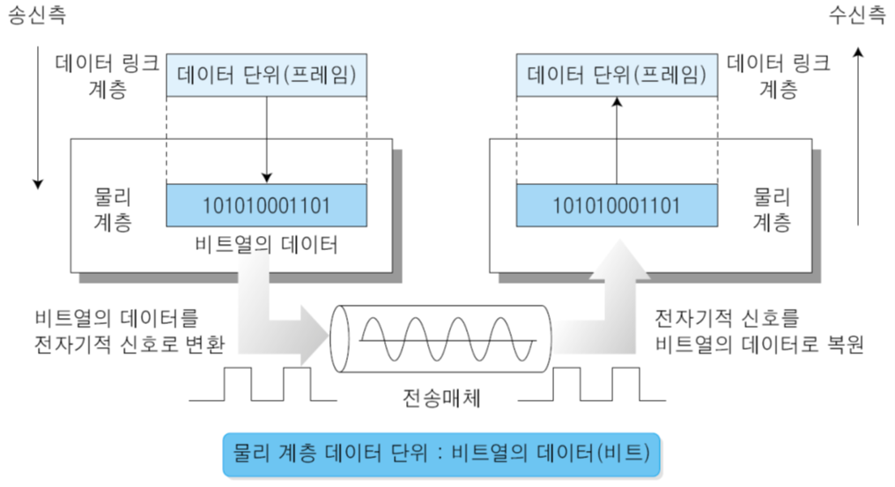
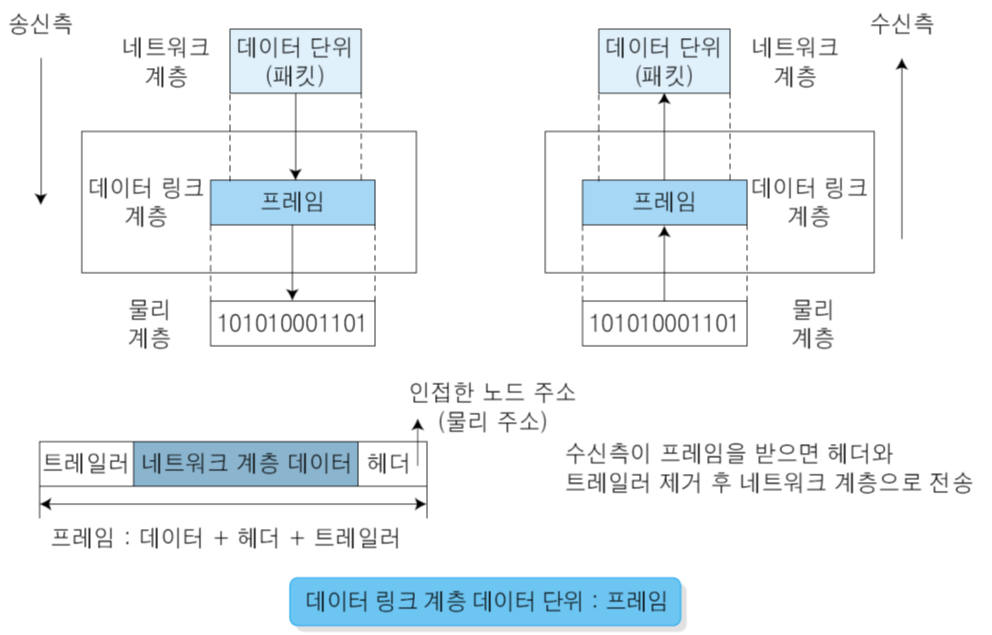
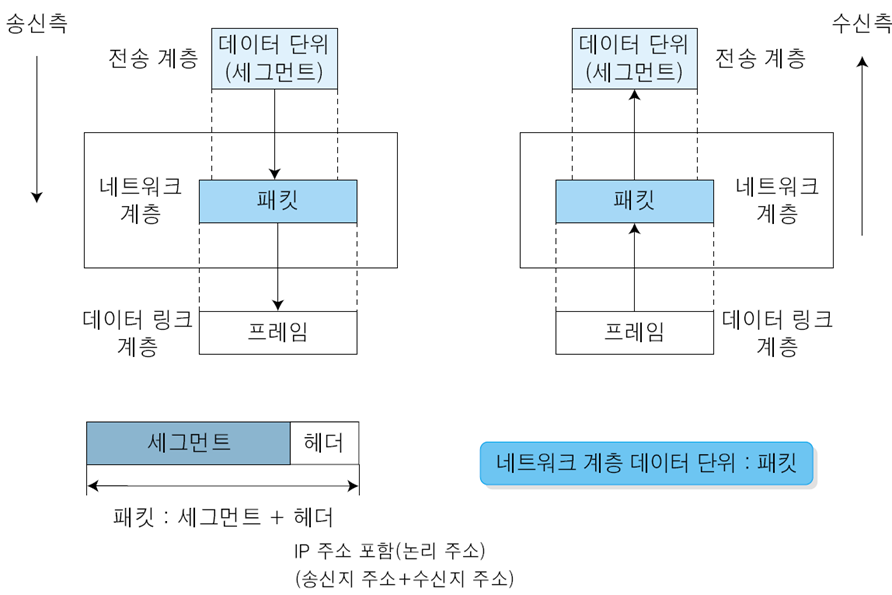
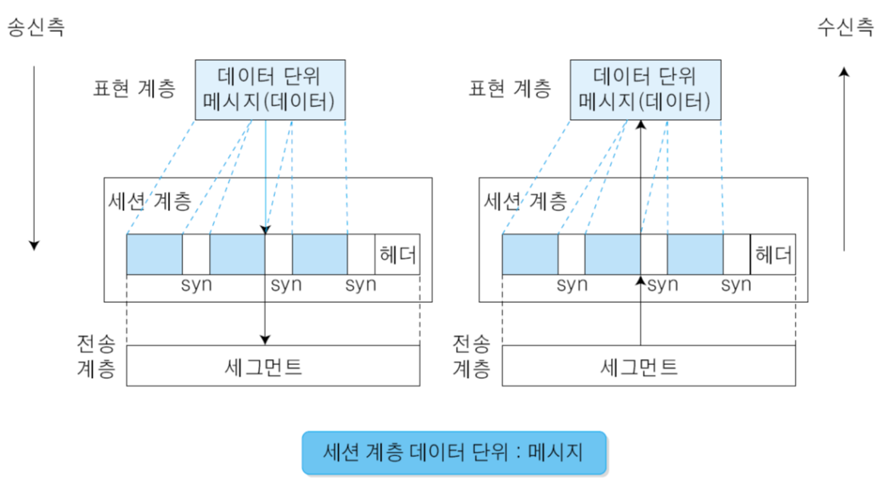
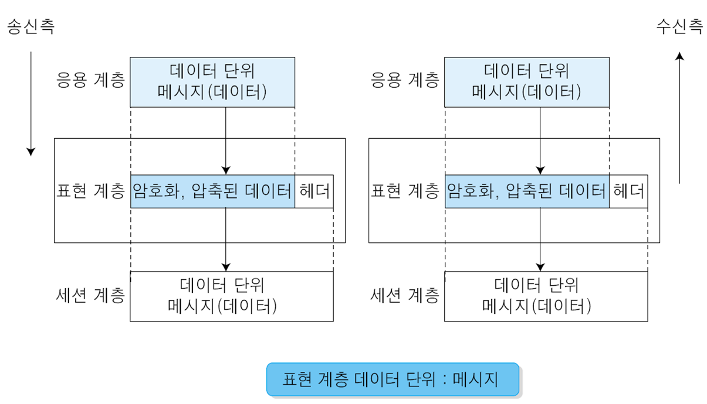
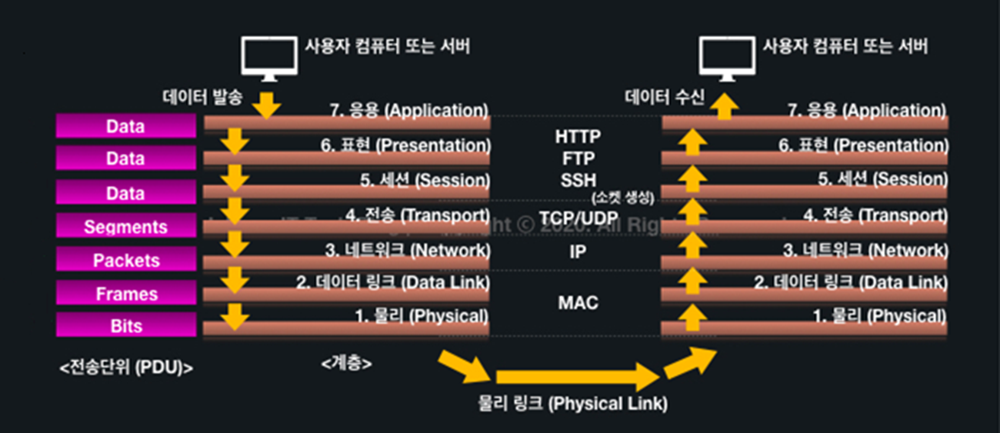

# OSI 7 Layer

## 🔷 OSI 7 Layer 한눈에 보기

> 7️⃣ Application   - 사용자와 가장 가까운 계층  
> 6️⃣ Presentation - 표현(형식, 암호화)  
> 5️⃣ Session      - 연결 유지/관리  
> 4️⃣ Transport    - 포트, 신뢰성  
> 3️⃣ Network      - IP, 라우팅  
> 2️⃣ Data Link    - MAC, 스위치  
> 1️⃣ Physical     - 케이블, 전기 신호

### 1️⃣ Physical Layer (물리 계층)



- 📌 역할  
  - 0과 1을 전기 신호 / 빛 / 전파로 전송  
  - 데이터의 “의미”는 전혀 모름

- 📌 다루는 것  
  - 케이블(UTP, 광케이블)
  - 전압, 전송 속도  
  - 커넥터(RJ45)  

- 📌 장비  
  - 허브(Hub)  
  - 리피터  
  - 랜선 자체  

👉 “신호가 가는가?”만 관심 있음

### 2️⃣ Data Link Layer (데이터 링크 계층)



- 📌 역할  
  - 같은 네트워크 내에서 장치 ↔ 장치 전달
  - 오류 검출, 프레임 단위 전송

- 📌 핵심 개념
  - MAC 주소 (48bit)
  - 프레임(Frame)
  - ARP (IP → MAC)
  - 트레일러: 오류 검사용 정보 (FCS 포함)
  - FCS(프레임이 전송 중에 손상되었는지 확인하는 오류 검출 값)

- 📌 장비
  - 스위치(Switch)
  - 브리지

👉 “이 MAC 주소 누구야?”

### 3️⃣ Network Layer (네트워크 계층)



- 📌 역할
  - 다른 네트워크로 이동
  - 최적 경로 선택 (라우팅)

- 📌 핵심 개념
  - IP 주소
  - 라우팅 테이블
  - 패킷(Packet)

- 📌 장비
  - 라우터
  - L3 스위치

👉 “이 IP는 어느 네트워크로 가야 하지?”

### 4️⃣ Transport Layer (전송 계층)


- 📌 역할
  - 프로세스 ↔ 프로세스 통신
  - 신뢰성, 흐름 제어

- 📌 핵심 개념
  - 포트 번호
  - TCP / UDP
  - 세그먼트(Segment)

- 📌 프로토콜
  - TCP: 신뢰성 O (웹, 메일)
  - UDP: 빠름, 신뢰성 X (게임, 스트리밍)

👉 “이 데이터, 제대로 다 왔어?”

### 5️⃣ Session Layer (세션 계층)



- 📌 역할
  - 통신 세션 생성 / 유지 / 종료
  - 중간에 끊기면 복구

- 📌 예시
  - 로그인 세션
  - 스트리밍 중 재연결

👉 “지금 연결 상태 유지할까? 끊을까?”  
현실에서는 4~7 계층에 흡수되는 경우 많음

### 6️⃣ Presentation Layer (표현 계층)



- 📌 역할
  - 데이터 형식 변환
  - 암호화 / 압축

- 📌 예시
  - SSL/TLS 암호화
  - UTF-8 ↔ ASCII 변환
  - JPG, MP4 인코딩

👉 “이 데이터를 어떻게 보여줄까?”

### 7️⃣ Application Layer (응용 계층)

- 📌 역할
  - 사용자가 직접 사용하는 네트워크 서비스

- 📌 프로토콜
  - [HTTP](../2026-02-09/2026-02-09-HTTP.md) / [HTTPS](../2026-02-09/2026-02-09-HTTPS.md)
  - FTP
  - SMTP, POP3, IMAP
  - DNS

- 📌 예시
  - 웹 브라우저
  - 이메일 클라이언트

👉 “사용자가 보는 진짜 네트워크”

---

## 한눈에 보기



## 🎯 2️⃣ 영어로 외우는 방법

```bash
Application (응용)
Presentation (표현)
Session (세션)
Transport (전송)
Network (네트워크)
Data Link (데이터링크)
Physical (물리)
```

앞글자: **A P S T N D P**

대표 암기 문장:

> **All People Seem To Need Data Processing**  
> (모든 사람이 데이터 처리가 필요한 것 같습니다)

---

## 💡 3️⃣ “위에서 아래로 역할 흐름”으로 이해하며 외우기

그냥 외우면 잘 까먹어요.
"데이터가 내려가는 과정"을 스토리로 생각해보세요.

📦 데이터를 보내는 과정:

1. **응용** → 사용자 프로그램 (브라우저)
2. **표현** → 암호화, 압축
3. **세션** → 연결 유지
4. **전송** → 포트번호 (TCP/UDP)
5. **네트워크** → IP 주소
6. **데이터링크** → MAC 주소
7. **물리** → 전기 신호

이렇게 보면:

👉 **사람 → 프로그램 → 연결 → 포트 → IP → MAC → 전기선**

이 흐름을 자연스럽게 익히자.

---

## 🚀 4️⃣ 내가 추천하는 “실전형 암기법”

시험에서 가장 많이 물어보는 포인트는:

- IP = 네트워크 계층
- MAC = 데이터링크 계층
- 포트 = 전송 계층
- 전기신호 = 물리 계층

그래서 아래 4개만 확실히 잡고
위 3개(응표세)는 묶어서 기억해도 됩니다.

👉 **“전송부터 아래는 주소 체계 계층”**

전송(Port)
네트워크(IP)
데이터링크(MAC)
물리(신호)

이 4개만 완전히 이해하면 OSI 문제 절반은 끝.

---

## 📦 OSI 계층별 PDU 흐름 (위 → 아래로 내려감)

```bash
[7~5 계층]  응용/표현/세션
---------------------------------
|              DATA              |
---------------------------------
```

⬇ 전송계층에서 TCP/UDP 헤더 추가

```bash
[4 계층] 전송 (TCP/UDP)
------------------------------------------------
| TCP/UDP Header |            DATA            |
------------------------------------------------
= Segment (또는 Datagram)
```

⬇ 네트워크계층에서 IP 헤더 추가

```bash
[3 계층] 네트워크 (IP)
----------------------------------------------------------------
| IP Header | TCP/UDP Header |              DATA              |
----------------------------------------------------------------
= Packet
```

⬇ 데이터링크계층에서 MAC 헤더 + Trailer 추가

```bash
[2 계층] 데이터링크 (Ethernet)
---------------------------------------------------------------------------------
| MAC Header | IP Header | TCP/UDP Header | DATA | FCS(Trailer) |
---------------------------------------------------------------------------------
= Frame
```

⬇ 물리계층에서 전기신호로 변환

```bash
[1 계층] 물리
0101010101010101010101010101010101010101010101010101
= Bit
```

---

## 🔥 한눈에 요약 구조

```bash
Frame
 └─ Packet
     └─ Segment
         └─ Data
```

👉 아래로 갈수록 "겉포장"이 하나씩 더 생긴다고 생각하세요.

---

## 🎯 핵심 연결 포인트 (시험 최중요)

- 포트번호 → 전송계층 → Segment
- IP주소 → 네트워크계층 → Packet
- MAC주소 → 데이터링크계층 → Frame
- 전기신호 → 물리계층 → Bit

---

## 💡 진짜 이해 포인트

보내는 쪽은 이렇게 **포장**하고
받는 쪽은 반대로:

```bash
Bit → Frame → Packet → Segment → Data
```

하나씩 벗겨요.
이걸 **역캡슐화(Decapsulation)** 라고 합니다.

---

## 예시 상황

> 💻 내가 크롬에서 `https://google.com` 접속

이때 데이터가 어떻게 포장되는지 단계별로 알아보자.

---

### 🧠 1️⃣ 응용계층 (HTTP)

브라우저가 이런 데이터를 만듭니다:

```bash
GET / HTTP/1.1
Host: google.com
```

👉 이 상태는 그냥 **Data**

---

### 🚪 2️⃣ 전송계층 (TCP)

- 출발지 포트: 52341 (랜덤)
- 목적지 포트: 443 (HTTPS)

이 정보가 붙어요.

```bash
[TCP Header: 52341 → 443]
GET / HTTP/1.1
Host: google.com
```

👉 이제 이름은 **Segment**

💡 여기서 "어떤 프로그램으로 보낼지" 결정됨 (포트번호!)

---

### 🌍 3️⃣ 네트워크계층 (IP)

- 출발지 IP: 192.168.0.10
- 목적지 IP: 142.250.206.14 (구글)

IP 헤더 추가:

```bash
[IP Header: 192.168.0.10 → 142.250.206.14]
    [TCP Header]
        HTTP Data
```

👉 이제 이름은 **Packet**

💡 여기서 "어디 컴퓨터로 갈지" 결정됨 (IP주소!)

---

### 🔌 4️⃣ 데이터링크계층 (MAC)

- 출발지 MAC: AA-AA-AA-AA-AA-AA
- 목적지 MAC: 공유기 MAC (예: BB-BB-BB-BB-BB-BB)

```bash
[MAC Header]
    [IP Header]
        [TCP Header]
            HTTP Data
[FCS]
```

👉 이제 이름은 **Frame**

💡 여기서 "바로 옆 장치 누구한테 줄지" 결정됨 (MAC주소!)

---

### ⚡ 5️⃣ 물리계층

이 모든 게

```bash
0101010101010101010101
```

전기 신호로 변환되어 랜선/와이파이로 날아갑니다.

👉 **Bit**

---

### 🚀 전체 흐름 한눈에

```bash
HTTP 요청 (Data)
 → TCP 붙음 (Segment)
   → IP 붙음 (Packet)
     → MAC 붙음 (Frame)
       → Bit로 변환
```

---

### 🎯 진짜 중요한 이해 포인트

많이 헷갈리는 부분:

❓ 왜 MAC 목적지가 구글 MAC이 아니고 공유기 MAC이냐?

👉 인터넷 나갈 때는 "다음 목적지(게이트웨이)" MAC만 알면 됨
MAC은 매 홉마다 바뀜
IP는 끝까지 유지됨

이게 진짜 핵심입니다.

---

### 💎 완전 실전 정리

|계층|붙는 정보|결정하는 것|
|-----|-----|-------|
|전송|Port|어떤 프로그램|
|네트워크|IP|어떤 컴퓨터|
|데이터링크|MAC|바로 옆 장치|
|물리|Bit|실제 전송|

---
