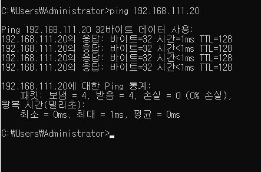

# Ping



---

## 📌 1️⃣ PING의 정의

> PING(Packet Internet Groper)은
> **네트워크 대상이 살아있는지 확인하는 명령어**이다.

쉽게 말하면:

👉 “너 거기 살아있어?” 하고 물어보는 것

---

## 📌 2️⃣ PING은 어떤 프로토콜을 쓰나?

PING은 **ICMP 프로토콜**을 사용한다.

정확히는:

* ICMP Echo Request (요청)
* ICMP Echo Reply (응답)

---

## 📌 3️⃣ PING 작동 원리 (전체 흐름)

예를 들어:

```bash
ping 8.8.8.8
```

### 🔹 1단계: Echo Request 전송

내 PC가 ICMP 패킷을 보냄

구조는 대략 이런 느낌:

```bash
[IP Header]
[ICMP Header]
[Data]
```

---

### 🔹 2단계: 네트워크 이동

패킷이 라우터를 거쳐 목적지로 이동
이때 TTL 값이 하나씩 감소

---

### 🔹 3단계: 목적지 도착

목적지 서버가 ICMP Echo Reply 생성

---

### 🔹 4단계: 응답 반환

응답이 다시 내 PC로 돌아옴

---

## 📌 4️⃣ RTT (응답 시간)

PING은 왕복 시간을 계산함.

```bash
Request → 서버 → Reply → 내 PC
```

이 시간을 RTT (Round Trip Time) 이라고 함.

예:

```bash
time=12ms
```

→ 12밀리초 걸렸다는 의미

---

## 📌 5️⃣ TTL이 왜 보이나?

ping 결과 보면 이런 게 있음:

```bash
ttl=117
```

TTL = Time To Live

* 라우터 하나 지날 때마다 1 감소
* 0 되면 패킷 폐기

→ 네트워크 홉 수 유추 가능

---

## 📌 6️⃣ 실제 출력 예시 해석

```bash
Reply from 8.8.8.8:
bytes=32 time=15ms TTL=117
```

|항목|의미|
|-----|------|
|bytes|데이터 크기|
|time|왕복시간|
|TTL|남은 생존값|

---

## 📌 7️⃣ 응답이 없으면?

### 🔹 Request timed out

→ 서버가 응답 안 함 (방화벽 차단 가능성)

### 🔹 Destination host unreachable

→ 경로 자체가 없음

---

## 📌 8️⃣ PING은 무엇을 확인하나?

|확인 가능|설명|
|--------|---------|
|서버 살아있는지|기본 연결 여부|
|네트워크 지연|RTT 확인|
|패킷 손실률|% loss 확인|

---

## 📌 9️⃣ 중요한 점

PING은:

❌ TCP 사용 안 함
❌ 포트 사용 안 함
✔ ICMP만 사용

그래서:

* 웹은 되는데 ping은 안 될 수도 있음
* ping은 되는데 웹은 안 될 수도 있음

---

## 🔥 한 문장 정리

> PING은 ICMP Echo 메시지를 이용해 대상의 생존 여부와 네트워크 상태를 확인하는 도구이다.

---
