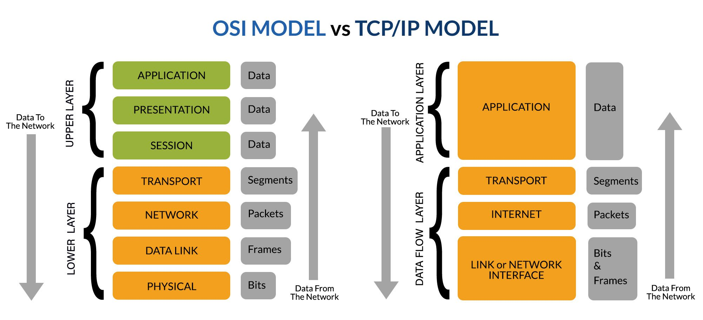

# 2026-02-19-TCP_IP

## ✅ TCP/IP 계층 모델 (TCP/IP Layer Model)

TCP/IP 모델은 인터넷에서 실제로 사용하는 **현실적인 네트워크 모델**.
DARPA에서 개발했고, 현재 인터넷의 기반 구조가 되었다.

## 📚 TCP/IP 4계층 구조

```bash
[ Application ]  ← 응용 계층
[ Transport   ]  ← 전송 계층
[ Internet    ]  ← 인터넷 계층
[ Network Access ] ← 네트워크 접근 계층
```

---

## 1️⃣ Application 계층 (응용 계층)

💡 사용자가 직접 사용하는 프로그램이 동작하는 계층

- 역할
  - 웹, 이메일, 파일 전송 등
  - 데이터 생성

- 대표 프로토콜
  - HTTP
  - FTP
  - SMTP
  - DNS

👉 OSI 모델의 **7~5계층(응용/표현/세션)**을 하나로 합친 개념.

---

## 2️⃣ Transport 계층 (전송 계층)

💡 데이터의 신뢰성, 속도 제어 담당

- 역할
  - 포트 번호 사용
  - 오류 제어
  - 흐름 제어

- 대표 프로토콜
  - [**TCP**](./2026-02-19-TCP.md)
    - 신뢰성 있음
    - 순서 보장
    - 3-way handshake 사용
  - [**UDP**](./2026-02-19-UDP.md)
    - 빠름
    - 신뢰성 없음
    - 실시간 스트리밍에 사용

---

## 3️⃣ Internet 계층 (인터넷 계층)

💡 IP 주소 기반으로 목적지까지 라우팅

- 역할
  - 논리적 주소(IP)
  - 경로 선택
  - 패킷 전달

- 대표 프로토콜
  - [**IP**](./2026-02-19-IP.md)
  - [**ICMP**](./2026-02-19-ICMP.md) (ping)
  - ARP

👉 OSI의 **3계층(Network Layer)**에 해당

---

## 4️⃣ Network Access 계층 (네트워크 접근 계층)

💡 실제 물리적 전송 담당

- 역할
  - MAC 주소 사용
  - 프레임 단위 전송
  - 물리적 케이블 통신

👉 OSI의 1~2계층(물리 + 데이터링크)을 합친 개념

---

## 📊 OSI 모델과 비교

| TCP/IP         | OSI |
| -------------- | --- |
| Application    | 7~5 |
| Transport      | 4   |
| Internet       | 3   |
| Network Access | 2~1 |

👉 TCP/IP가 더 실무 중심이고 단순해.



---

## 📦 데이터 흐름 예시 (웹 접속)

1. Application → HTTP 요청 생성
2. Transport → TCP가 세그먼트 생성
3. Internet → IP가 패킷 생성
4. Network Access → 이더넷 프레임으로 전송

---

## 🔥 핵심 정리

✔ TCP/IP는 인터넷 표준 모델
✔ 4계층 구조
✔ 실제 네트워크는 TCP/IP 기반
✔ OSI는 개념 설명용, TCP/IP는 실사용
