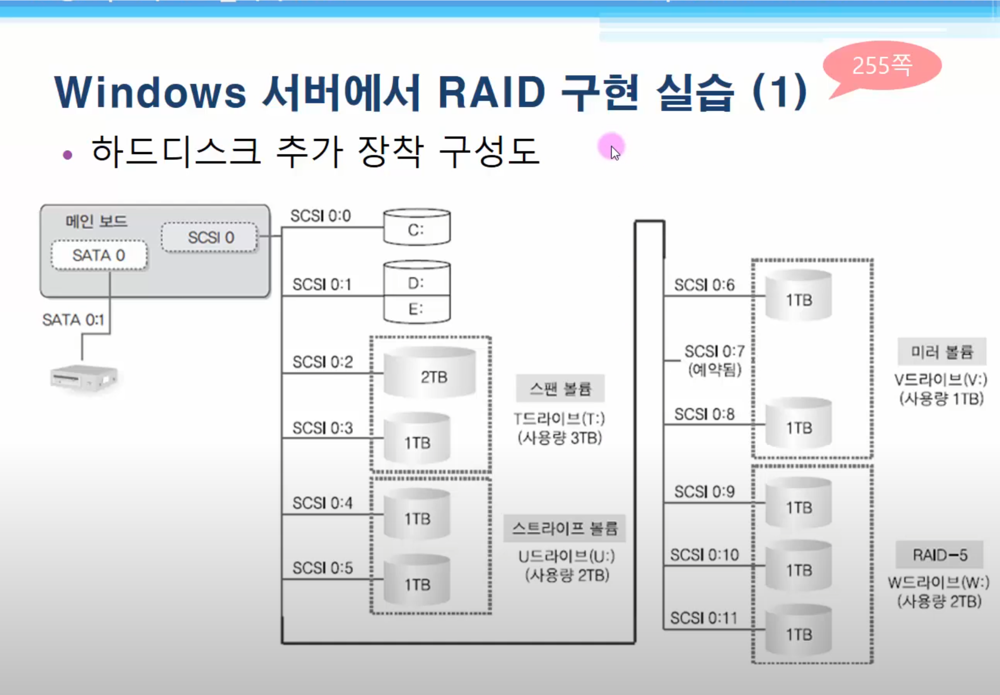

# 2026-02-25-RAID

## 전제 조건  

- 아래 설계대로 실습한다.

  

- VM에 이미 [RAID 실습을 진행할 하드디스크를 모두 설치](/2026-02-25/2026-02-25-VMWare_HDD_Setting.md) 완료한 상태여야 한다.

---

## GUI

[GUI로 실습하는 방법](/2026-02-25/2026-02-25-RAID_GUI.md)

## cmd

[CMD로 실습하는 방법](/2026-02-25/2026-02-25-RAID_CMD.md)
