# 2026-02-25-RAID

## 전제 조건  

- 아래 설계대로 실습한다.

  

- VM에 이미 [RAID 실습을 진행할 하드디스크를 모두 설치](/2026-02-25/2026-02-25-VMWare_HDD_Setting.md) 완료한 상태여야 한다.

---

## GUI

### 초기 세팅

`win` + `r` 으로 실행창 열고 `diskmgmt.msc` 입력하거나  
`시작 > 우클릭 > 디스크관리`를 클릭해서 `디스크 관리`창 열기

 
하단 디스크 목록에 새로 설치한 알수없는 디스크들이 있는데 우클릭 해서 모두 `온라인`한다.

 
모두 `온라인` 했으면 다시 우클릭해서 `디스크 초기화`를 클릭한다.

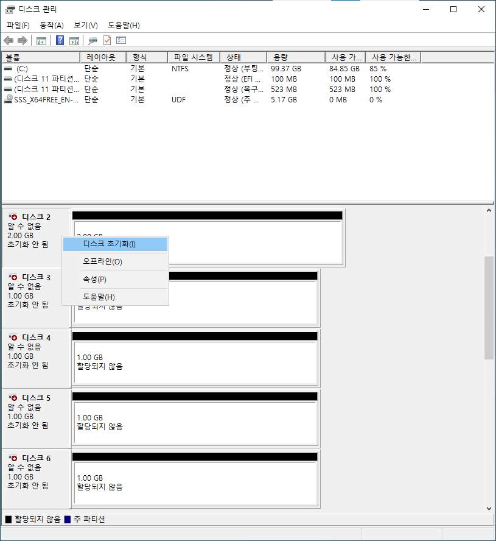

 
그럼 아래와 같은 창이 열리는데 디스크 목록과 파티션 형식을 설정하고 `확인` 클릭

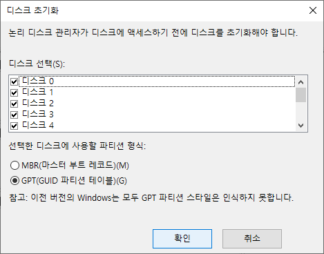

 
그럼 이렇게 `기본` 상태로 바뀐것을 확인 가능

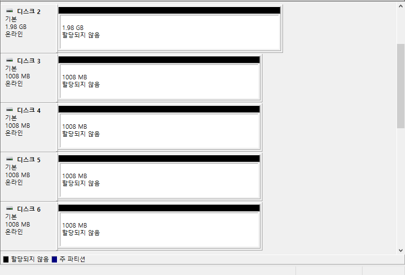

---

 

### Span 볼륨 만들기

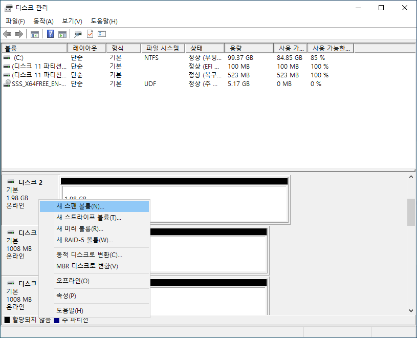

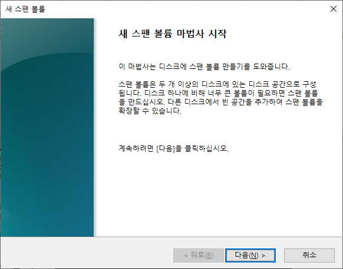

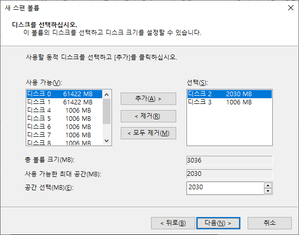

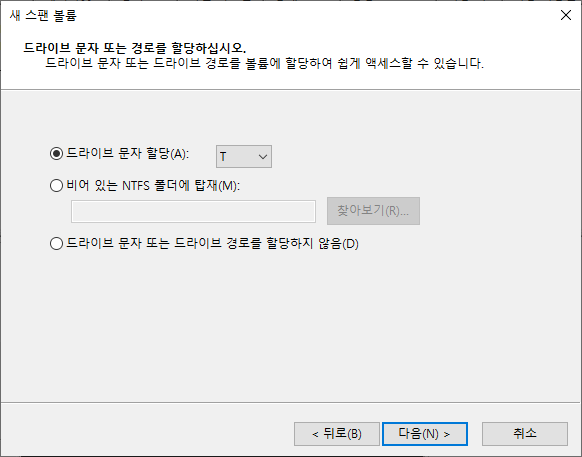

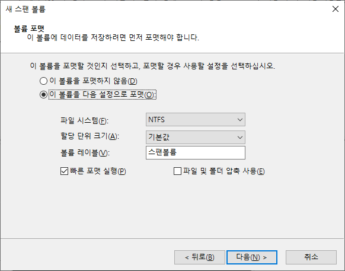

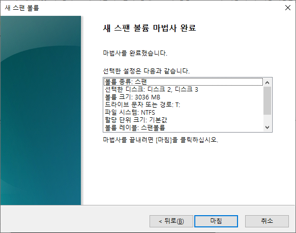

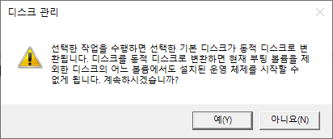

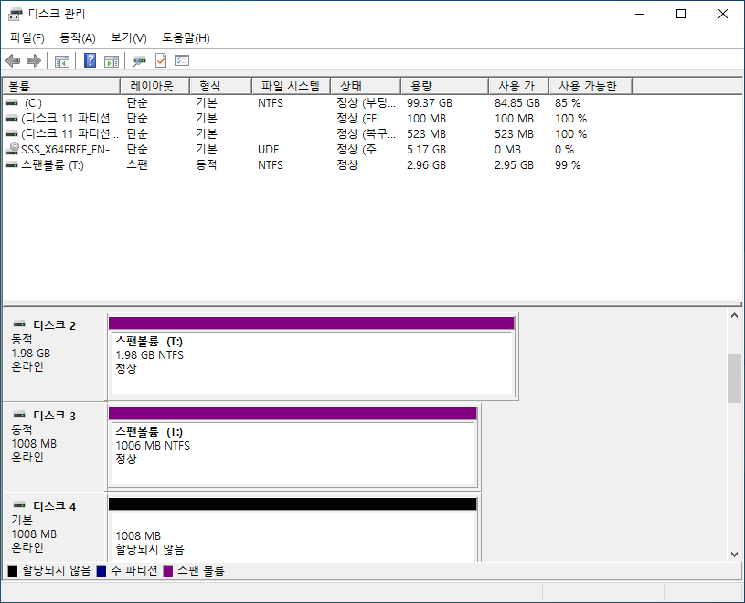

### 스트라이프 볼륨 만들기

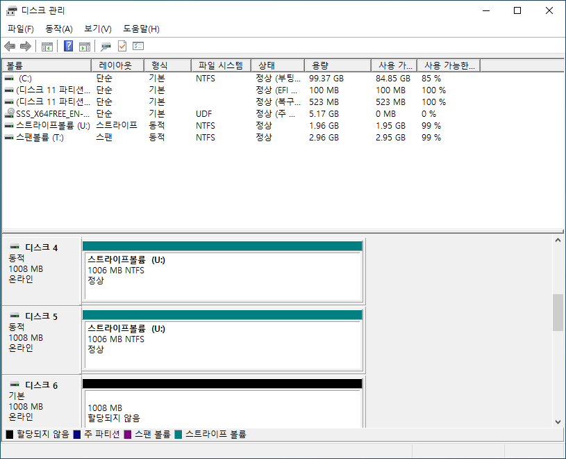

### 미러 볼륨 만들기

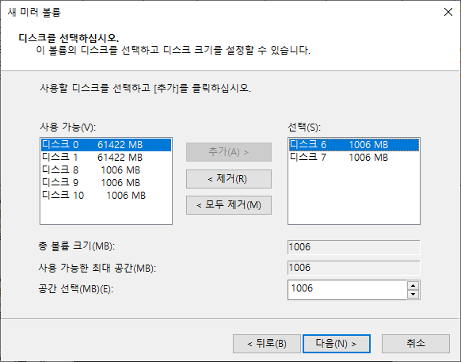
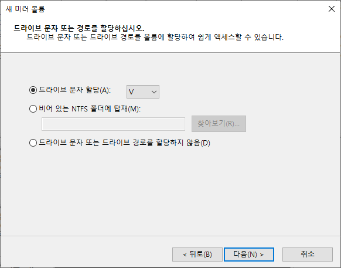

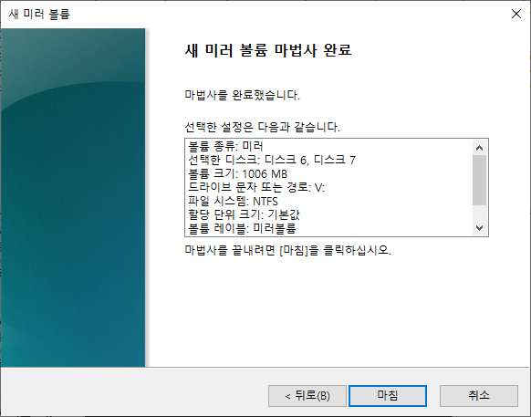
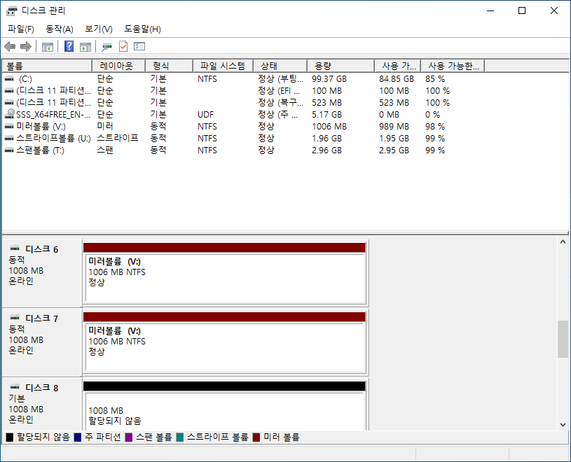

### RAID-5 볼륨 만들기

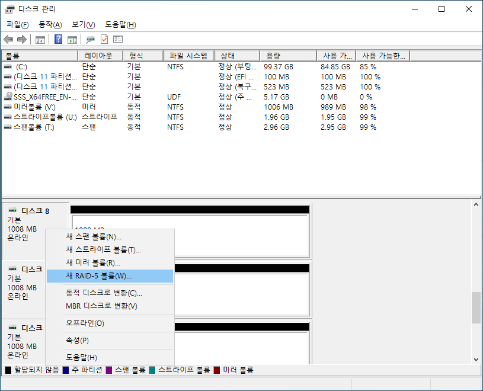

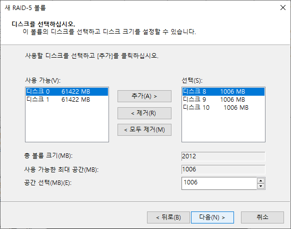

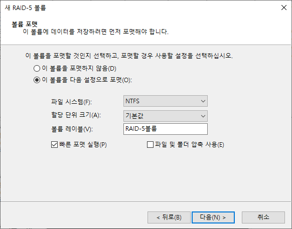

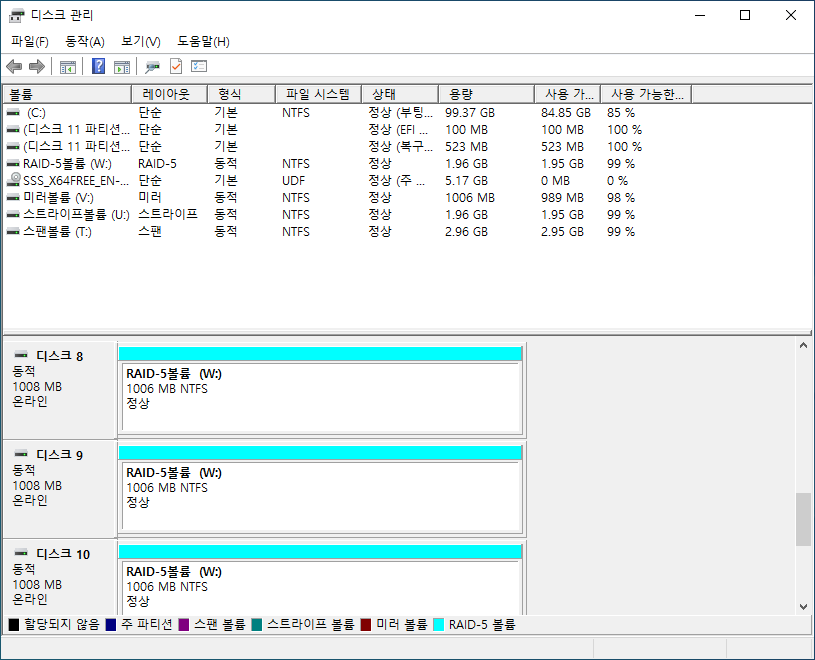

## cmd

## powershell
