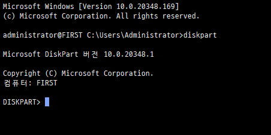
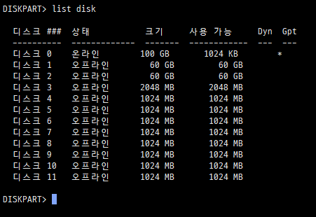
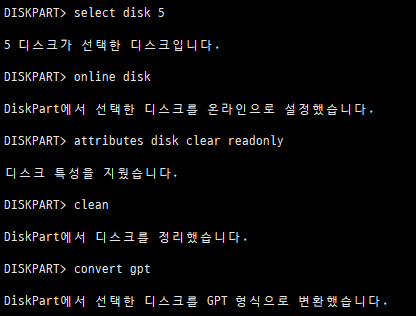
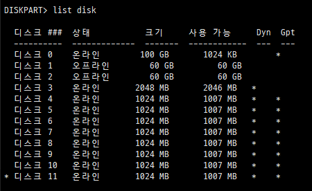
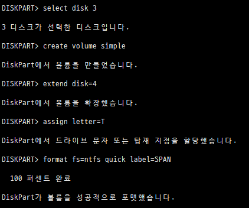
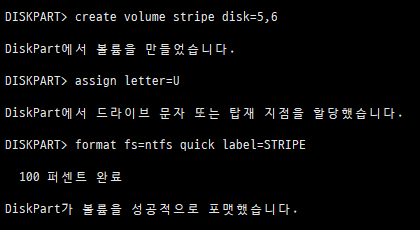
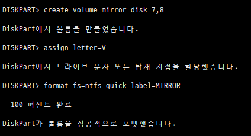
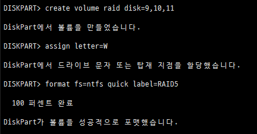
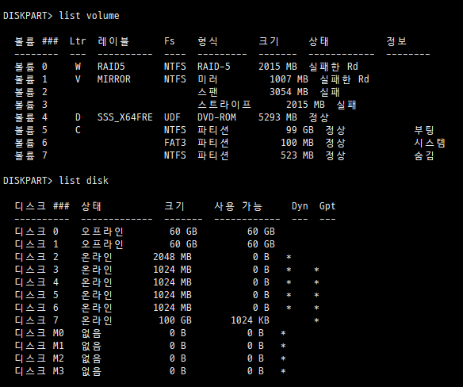
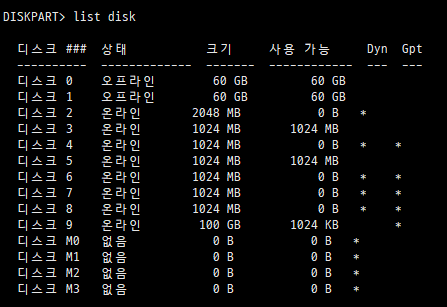

# 2026-02-25-RAID_CMD

아래는 **GUI에서 수행한 흐름과 동일한 순서**로 `CMD → diskpart`를 이용해 실습하는 방법이다.
(Windows Server 기준이며, RAID-5는 클라이언트 Windows에서는 생성 불가)

---

## 1. diskpart 실행

```bash
cmd
diskpart
```



현재 디스크 확인:

```bash
list disk
```



---

## 2. 새 디스크 온라인

오프라인 디스크가 있다면:

```bash
select disk 2
online disk
```

필요한 디스크 모두 반복

---

## 3. GPT 초기화

```bash
select disk 3
online disk
attributes disk clear readonly
clean
# gpt 형식으로 변환해야 할때
convert gpt

# RAID 실습으로 바로 가려면 위 GPT변환은 건너 뛰어도 됨
convert dynamic
```

따라서 RAID 실습만 빠르게 하려면 아래 그대로 복붙하면 빠름

```bash
select disk 3
online disk
attributes disk clear readonly
convert dynamic

```

- select disk n : n디스크 선택
- online disk : n디스크 온라인
- attributes disk clear readonly : 읽기전용 `아니오`로 변경
- clean : 디스크 정리
- convert gpt : 파티션 관리 방식 GPT 형식으로 변환



각 디스크마다 반복한다.



디스크 온라인 모두 완료된 상태

---

## Span 볼륨 생성

> 조건: 디스크 3, 4 사용

```bash
select disk 3
create volume simple size=1024 #이렇게 용량을 설정하거나
create volume simple #디스크 전체로 설정하거나 택1
```

```bash
# disk 확장
extend disk=4
```

디스크 문자 할당

```bash
assign letter=T
```

포맷하면서 라벨명 설정

```bash
format fs=ntfs quick label=SPAN
```



---

## Stripe 볼륨 생성 (RAID 0)

> 조건: 디스크 5, 6 사용

```bash
create volume stripe disk=5,6
assign letter=U
format fs=ntfs quick label=STRIPE
```



---

## Mirror 볼륨 생성 (RAID 1)

> 조건: 디스크 7, 8 사용

먼저 미러 생성:

```bash
create volume mirror disk=7,8
assign letter=V
format fs=ntfs quick label=MIRROR
```



---

## RAID-5 볼륨 생성

> 조건: 디스크 9, 10, 11 사용

```bash
create volume raid disk=9,10,11
assign letter=W
format fs=ntfs quick label=RAID5
```



---

## 디스크 장애 시뮬레이션

> VM 종료 → 각각 볼륨에서 하나씩 해당 SCSI 디스크 제거 후 부팅

## 상태 확인

```bash
diskpart
list volume
list disk
```



현재 상태를 정리하면 다음과 같습니다.

- 볼륨 상태

  | 볼륨    | 유형     | 상태                |
  | ----- | ------ | ----------------- |
  | W     | RAID-5 | 실패한 Rd (Degraded) |
  | V     | 미러     | 실패한 Rd (Degraded) |
  | 스팬    | 스팬     | 실패                |
  | 스트라이프 | 스트라이프  | 실패                |

  - **스팬 / 스트라이프 → 완전 사망 (복구 불가)**
  - **미러 / RAID-5 → 1개 디스크 손실 상태 (복구 가능)**

---

- 디스크 상태

  | 디스크   | 상태                 |
  | ----- | ------------------ |
  | 0,1   | 오프라인               |
  | 2~6   | 온라인 (Dynamic, GPT) |
  | 7     | 온라인 (100GB)        |
  | M0~M3 | 없음 (제거된 디스크 흔적)    |

  M0~M3는 제거된 디스크의 메타데이터 자리
  즉, 실제 물리 디스크가 빠진 상태

---

## 복구 시나리오 시작

> 목표:  
>
> 1. 미러 복구
> 2. RAID-5 복구

### 새 디스크 추가 (VM에서 2개 추가 후 부팅)

(어차피 스팬과 스트라이프 볼륨은 복구 못하므로 복구 가능한 미러와 RAID-5 볼륨에 쓸 2개만 추가하는것)

부팅 후 확인:

```bash
list disk
```



새 디스크가 `디스크 3`, `디스크 5` 으로 확인된다.

---

### 새 디스크 준비

각 디스크마다:

```bash
select disk 3
online disk
attributes disk clear readonly
convert gpt
convert dynamic

select disk 5
online disk
attributes disk clear readonly
convert gpt
convert dynamic
```

확인:

```bash
list disk
```

Dyn 열에 `*` 확인

---

### 미러 복구 (V 볼륨)

#### 현재 상태: 실패한 Rd

```bash
select volume V
detail volume
```

손실된 디스크 확인 후:

```bash
add disk=3
```

동기화 진행 확인:

```bash
detail volume
```

상태가 "재동기화 중" → 완료되면 정상

---

### RAID-5 복구 (W 볼륨)

```bash
select volume W
detail volume
```

복구 실행:

```bash
repair disk=9
```

동기화 진행 확인:

```bash
detail volume
```

완료되면 정상 상태로 변경

---

### 📌 중요 포인트

#### ❌ Span / Stripe

복구 불가
→ 새로 생성해야 함

```bash
delete volume X
```

후 재구성

**복구 시나리오는 추가 정리가 필요함 실습중에 VMWare 꼬였음**