# 2026-02-25-RAID_GUI

## GUI

### 초기 세팅

`win` + `r` 으로 실행창 열고 `diskmgmt.msc` 입력하거나  
`시작 > 우클릭 > 디스크관리`를 클릭해서 `디스크 관리`창 열기

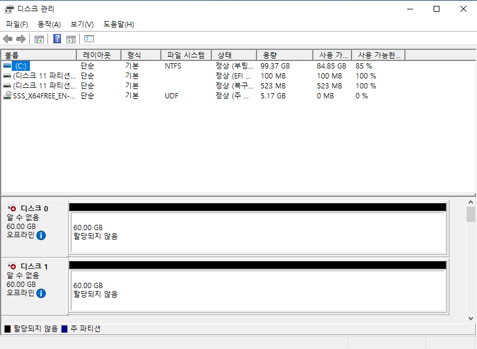

 
하단 디스크 목록에 새로 설치한 알수없는 디스크들이 있는데 우클릭 해서 모두 `온라인`한다.

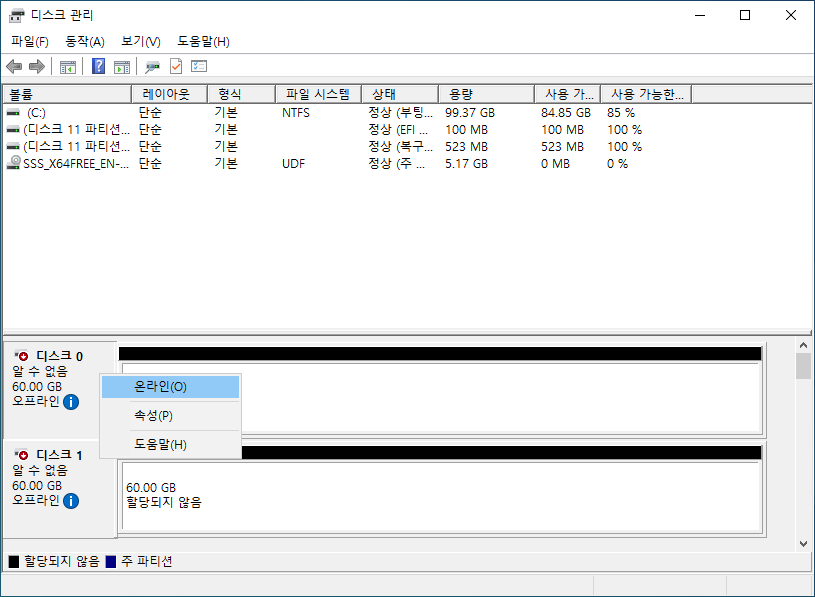

 
모두 `온라인` 했으면 다시 우클릭해서 `디스크 초기화`를 클릭한다.

 
그럼 아래와 같은 창이 열리는데 디스크 목록과 파티션 형식을 설정하고 `확인` 클릭

 
그럼 이렇게 `기본` 상태로 바뀐것을 확인 가능

---

 

### Span 볼륨 만들기

볼륨을 만들고자 하는 디스크에 우클릭 해서 `새 스팬 볼륨` 클릭

그럼 아래와 같은 창이 열린다. `다음` 클릭

왼쪽에서 원하는 디스크를 오른쪽에 추가 후 `다음` 클릭

설계도를 보고 알맞은 드라이브 문자 할당 후 `다음` 클릭

볼륨 레이블을 입력하고 `빠른 포멧` 체크 후 `다음` 클릭

설정완료

원래는 기본 상태에서 동적디스크 상태로 변경하고 진행해야하나 그렇게 하지 않아서 나오는 창. `예` 눌러주면 된다.

디스크2, 디스크3에 스팬볼륨이 설정된것을 확인 할 수 있다.

### 스트라이프 볼륨 만들기

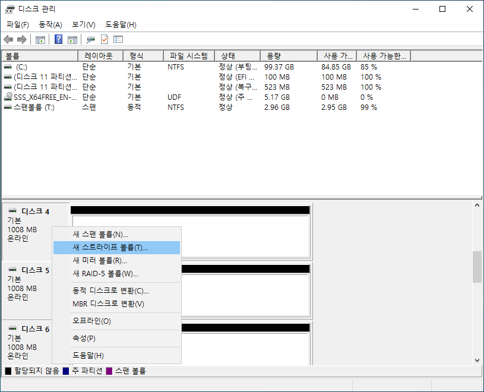
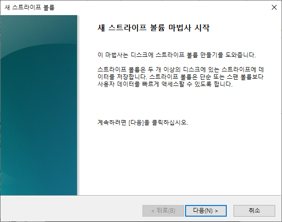
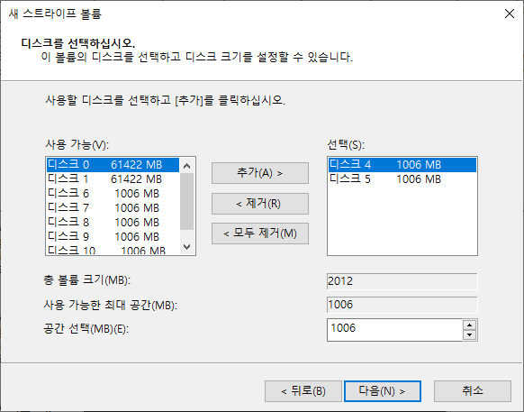
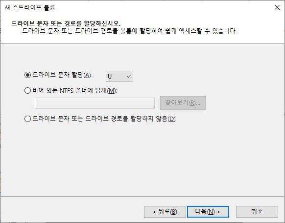
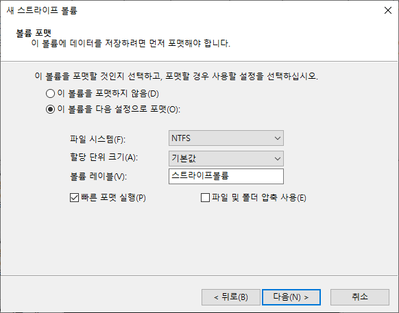
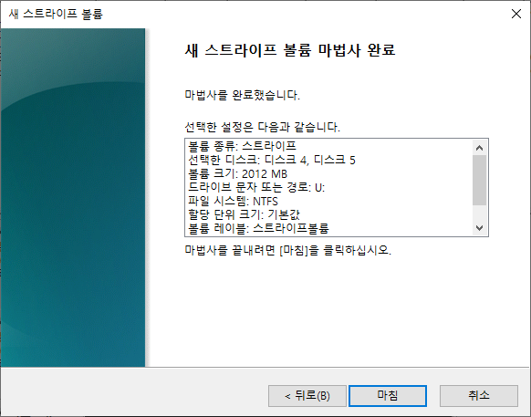

### 미러 볼륨 만들기

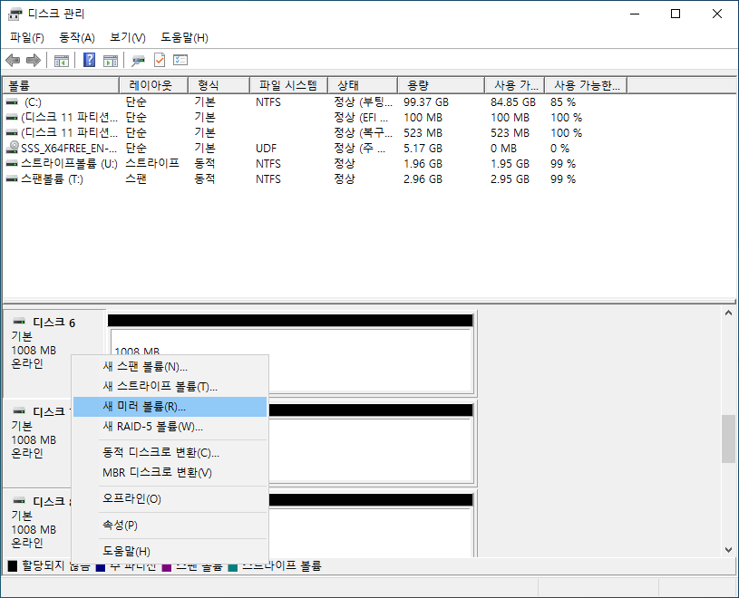
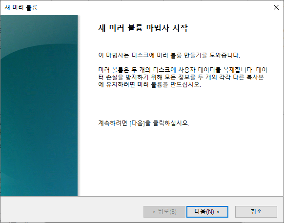

### RAID-5 볼륨 만들기

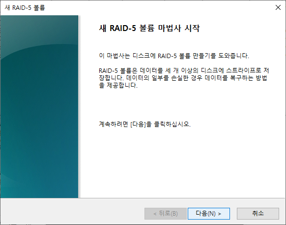

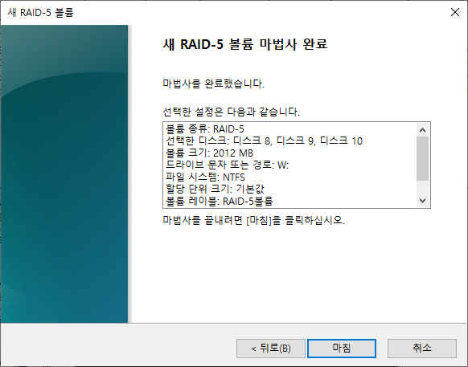

---

### 디스크 고장 복구 실습

각 볼륨들에 아래와 같이 확인을 위한 더미파일들을 넣어둔다.(아무파일이나 상관없음)
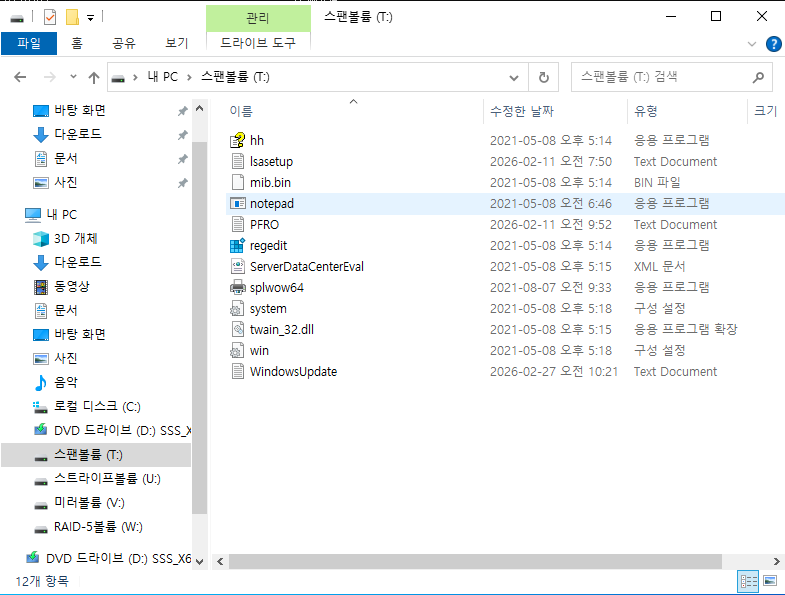

디스크 고장 실습 구성도는 다음과 같다.
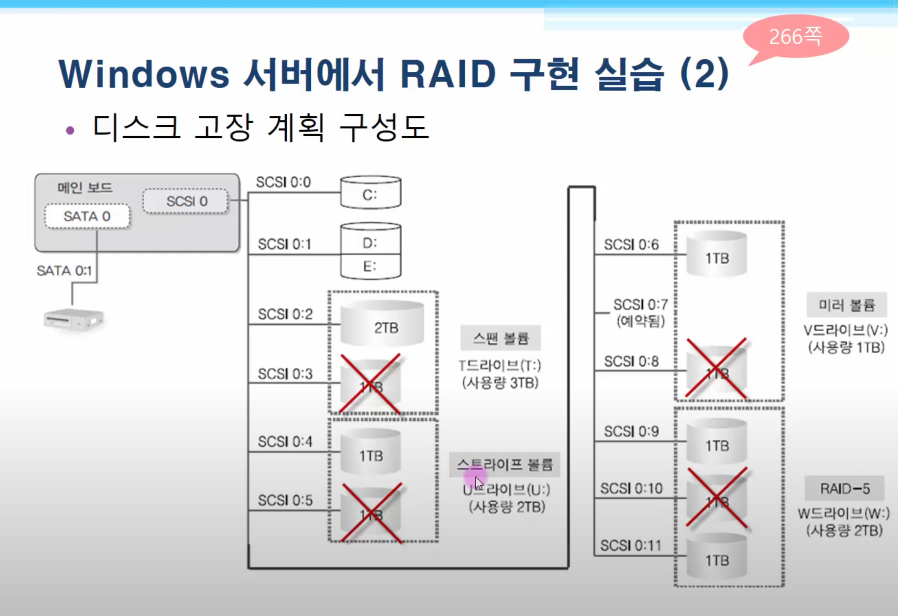

실습구성도에서 확인되는 고장난 HDD는 아래와 같다.

- 스팬볼륨 : SCSI 0:3
- 스트라이프볼륨: SCSI 0:5
- 미러볼륨 : SCSI 0:8
- RAID-5볼륨 : SCSI 0:10

VM을 종료하고 설정에서 하드디스크의 SCSI Address 확인하고 제거한다.
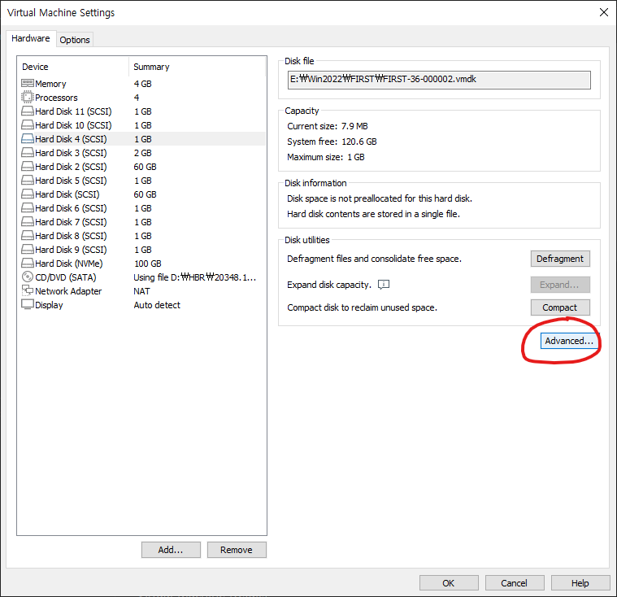
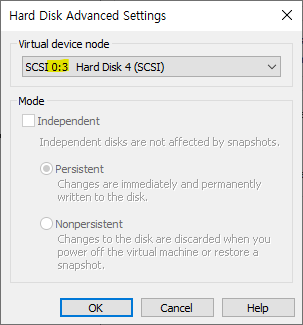

제거해도 우측하단 OK를 누르지 않으면 반영안되니까 실수로 지워도 당황 ㄴㄴ
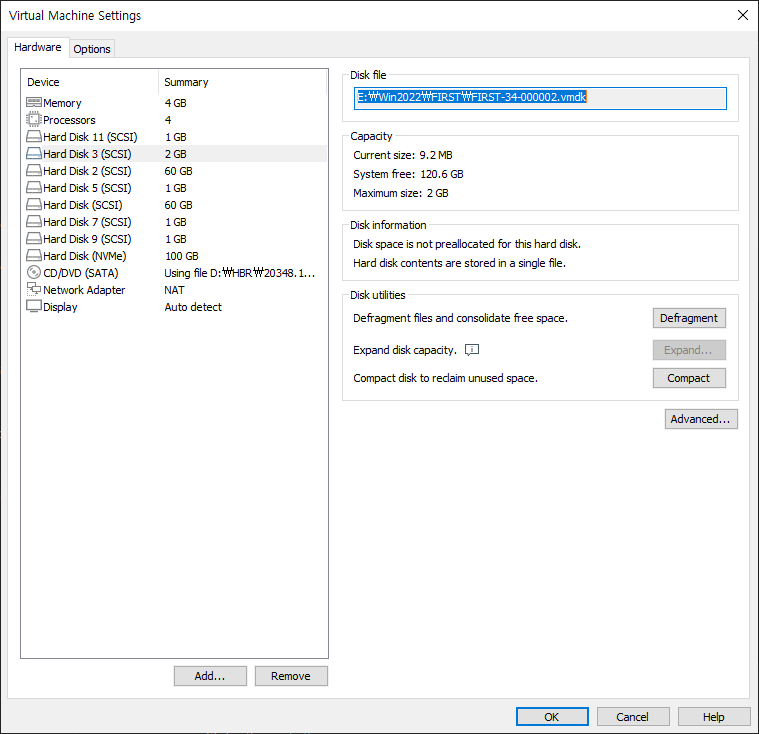

하드디스크 제거 후 다시 VM을 켜고 디스크관리를 열어보면 아래와 같은 상태
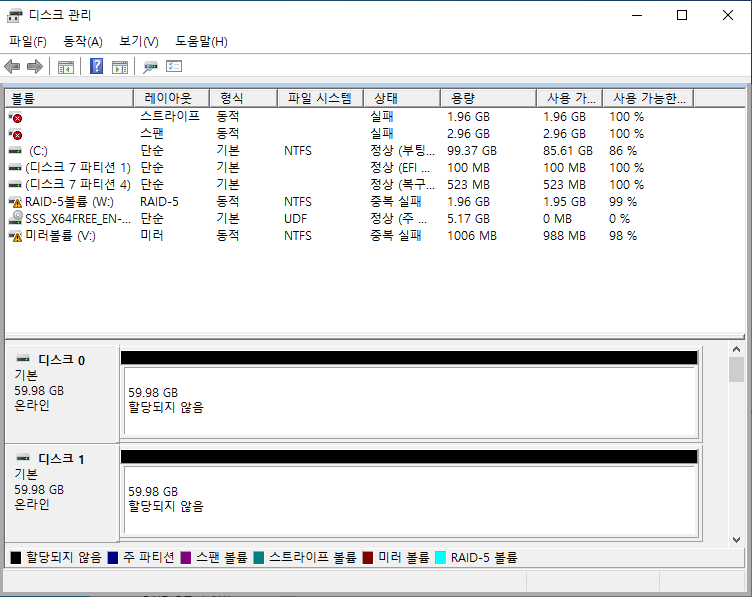

#### 🔴 실패 상태 볼륨

  |볼륨|유형|상태|의미|
  |-------|-----|--|---------------------|
  |(이름 없음)|스트라이프|실패|RAID 0 구성 디스크 중 하나 손실|
  |(이름 없음)|스팬|실패|스팬 볼륨 구성 디스크 중 하나 손실|

  **RAID 0 / 스팬은 내결함성이 없기 때문에 디스크 하나라도 고장 나면 전체 사용 불가**

#### 🟢 정상 볼륨

  |볼륨|유형|상태|설명|
  |---------|--|------|-------------|
  |C:|기본|정상(부팅)|OS 디스크|
  |EFI 파티션|기본|정상|UEFI 부트 영역|
  |복구 파티션|기본|정상|Windows 복구 영역|
  |DVD (UDF)|기본|정상|ISO 마운트|

#### 🟡 장애 발생했지만 동작 중인 볼륨

  |볼륨|유형|상태|의미|
  |--|------|---------|----------------------|
  |W:|RAID-5|**중복 실패**|1개 디스크 손실, 데이터는 아직 유지|
  |V:|미러|**중복 실패**|미러 디스크 1개 손실, 아직 사용 가능|

  “중복 실패” = **Degraded 상태 (축소 운영 상태)**
  즉, 복구 전까지는 추가 디스크 고장 시 데이터 완전 손실 위험

> 현재 스트라이프(RAID 0)와 스팬은 완전 사망 상태이며  
> 미러와 RAID-5는 디스크 1개 고장 상태로 위험하게 살아있는 상태.

---

#### 디스크 상태확인 & 복구

VM을 끈 후 다시 하드디스크를 4개 넣어주고 부팅한다

그리고 윈도우탐색기를 열어서 `장치 및 드라이브`를 보면  
`스팬`과 `스트라이프` 볼륨은 사라지고 미러와 RAID-5볼륨은 살아있는것을 볼 수 있다.
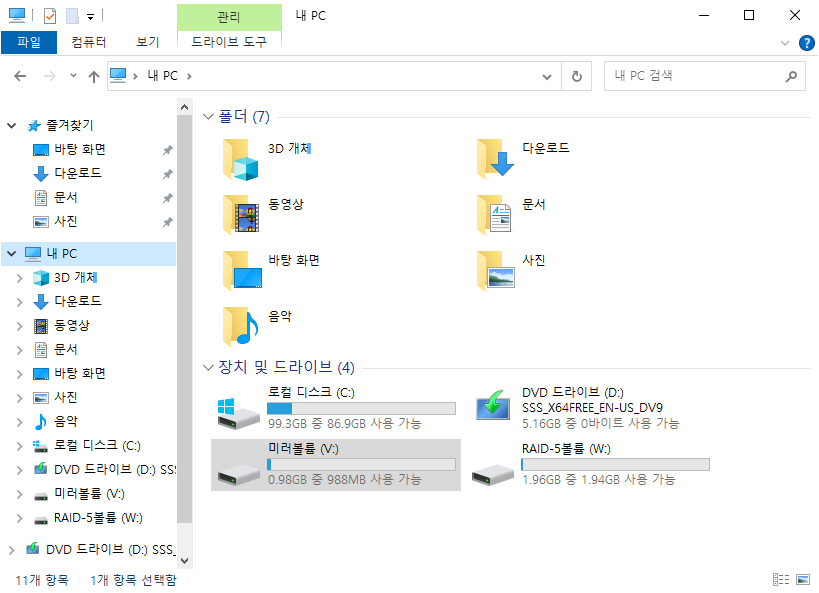

탐색기를 열어 확인해보면 데이터는 살아있는것을 확인할 수 있다.
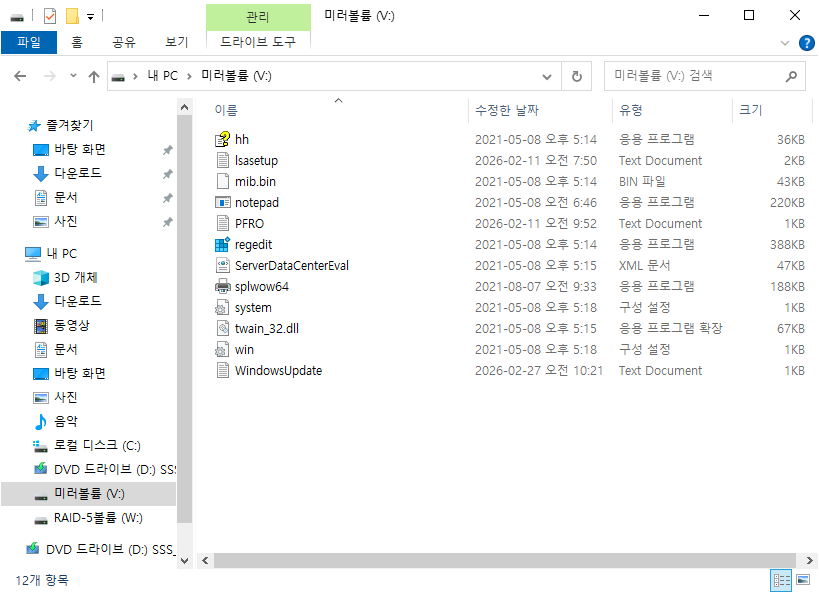
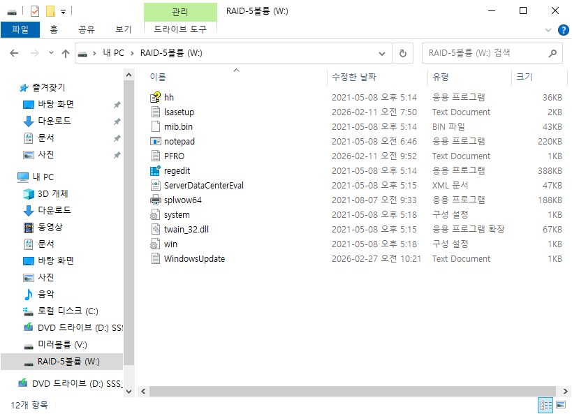

 
 

이제 디스크 관리창을 열면

새로 삽입한 디스크에 대해 디스크를 초기화 하라는 창이 뜬다.  
파티션 형식은 기존 디스크 들과 같아야 한다. `GPT`를 선택하고 `확인`을 눌러주자
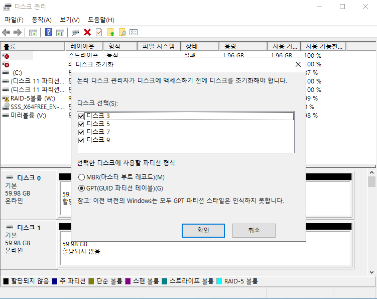

##### 미러 볼륨 복구

복구 하려는 미러 볼륨을 선택하고 우클릭 해서 미러 제거를 선택하고 `없음` 으로 표시된 디스크를 제거
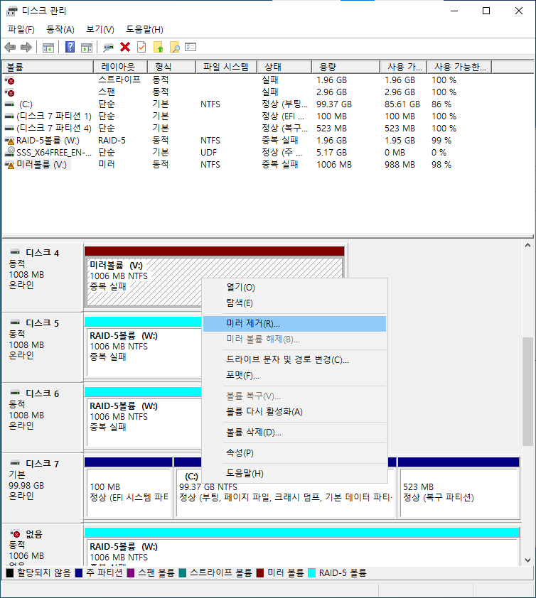
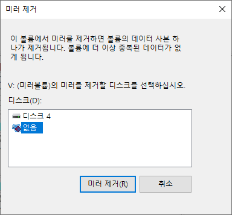

다시 복구하려는 미러 볼륨 선택 후 우클릭해서 `미러 추가` 클릭
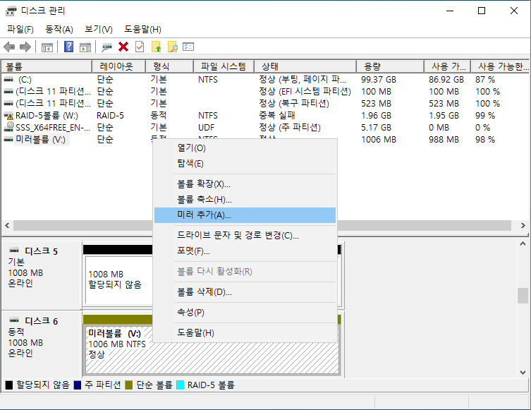

미러 볼륨으로 추가할 디스크를 선택(여기서는 디스트5)하고 `미러 추가` 클릭
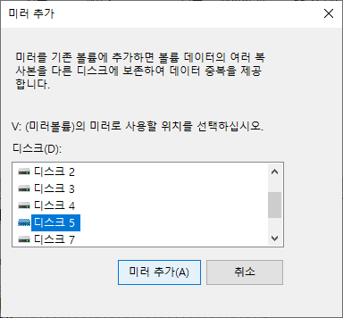

미러 볼륨이 정상적으로 복구 되었다.
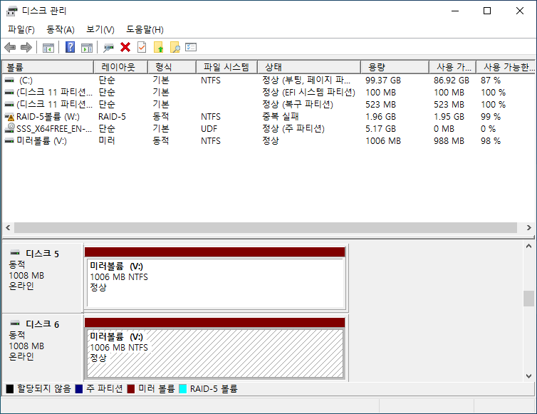

##### RAID-5 볼륨 복구

복구하고자 하는 RAID-5 볼륨 선택 후 우클릭 `볼륨 복구`클릭
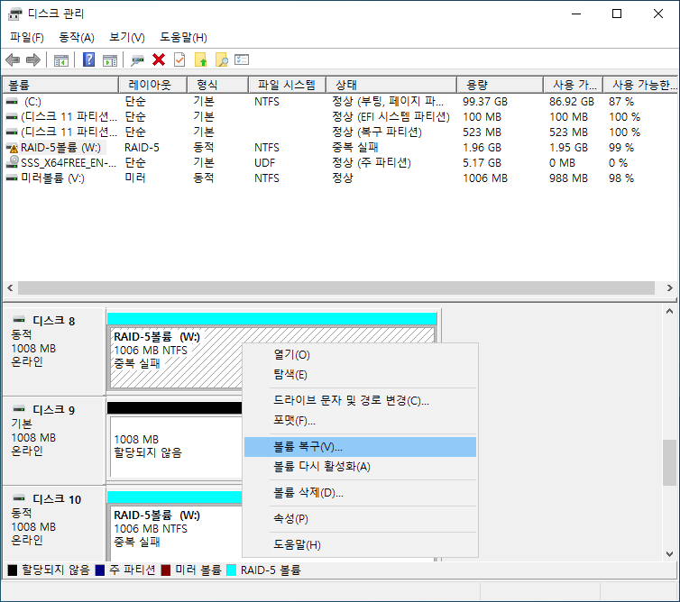

손상된 볼륨을 대체할 디스크 선택(여기서는 디스크 9)하고 `확인`
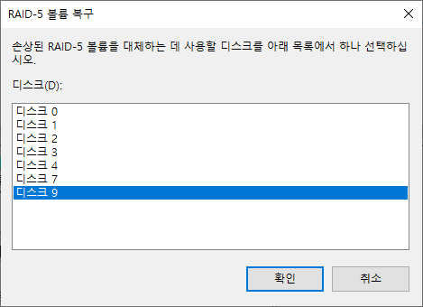

잠깐의 동기화 시간을 거치면 복구가 완료된것을 확인 할 수 있다.
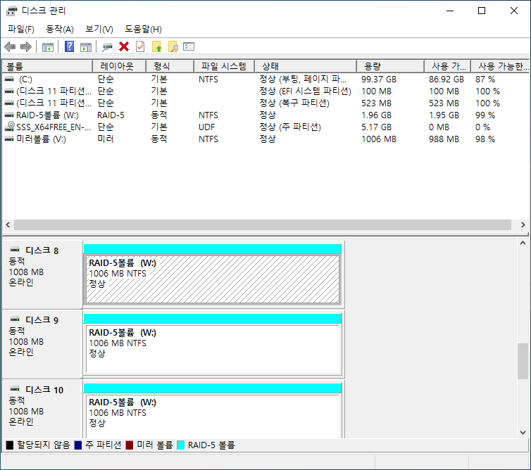
