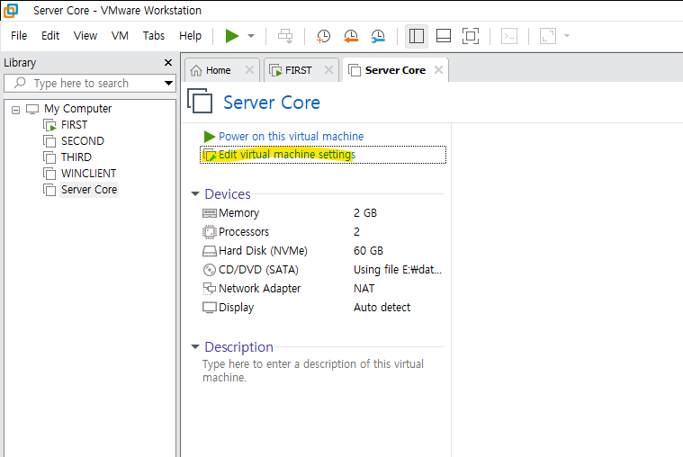
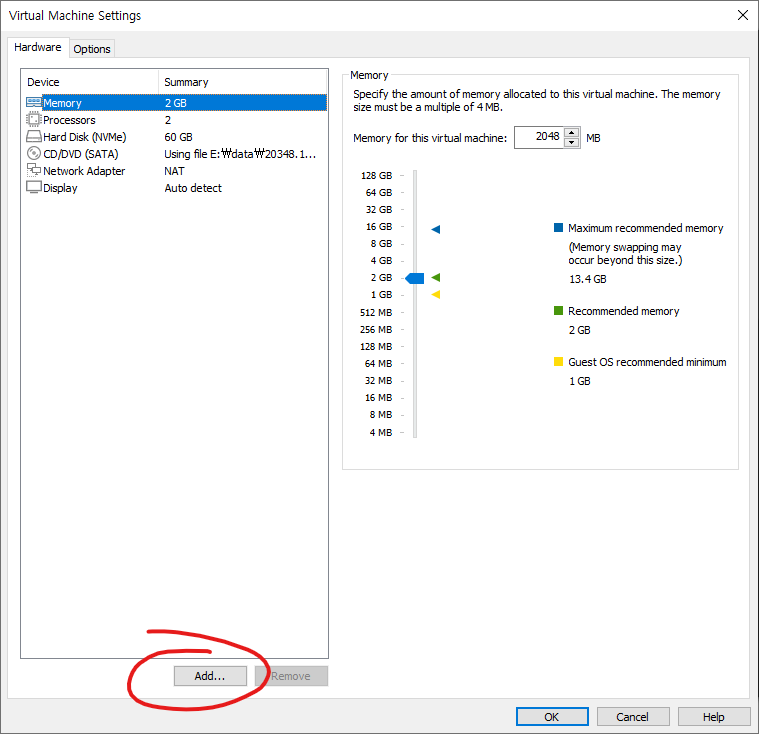
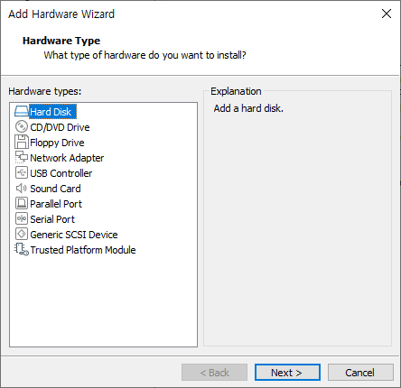
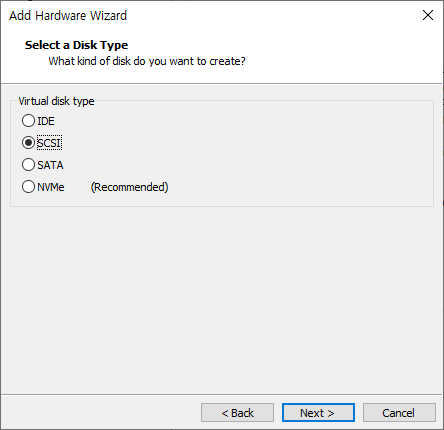
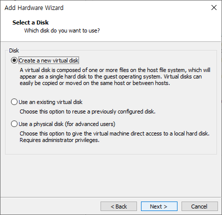
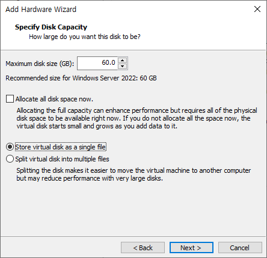
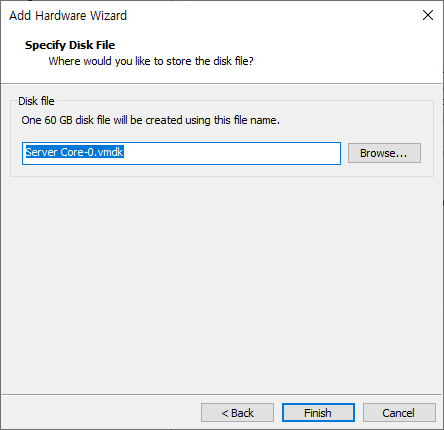
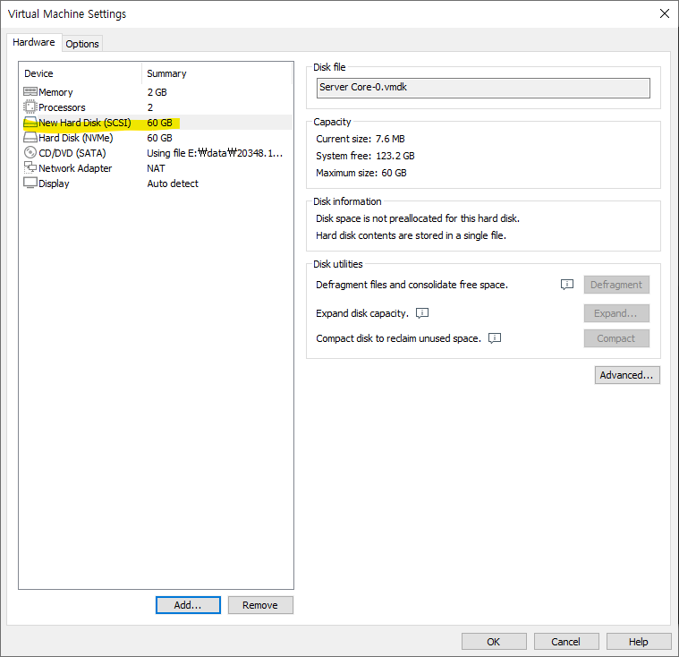

# 2026-02-25-VMWare_HDD_Setting

## VM 설정 클릭

---

## `Add...` 클릭

---

## `Hard Disk` 선택 후 `Next`

---

## 디스크 타입 선택 (여기서는 SCSI로 선택)

---

## `Create new virtual disk` 선택 후 `Next`

---

## 용량 설정 후 `Single file`로 선택, 그리고 `Next`

---

## 그냥 디스크파일 이름 정하는거임 바로 `Finish`

---

## 설치 확인

