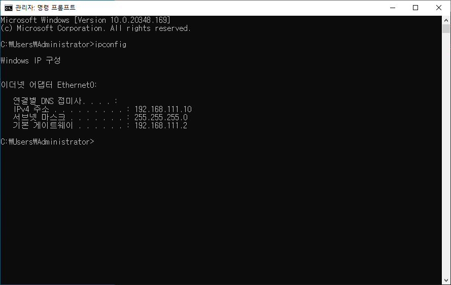
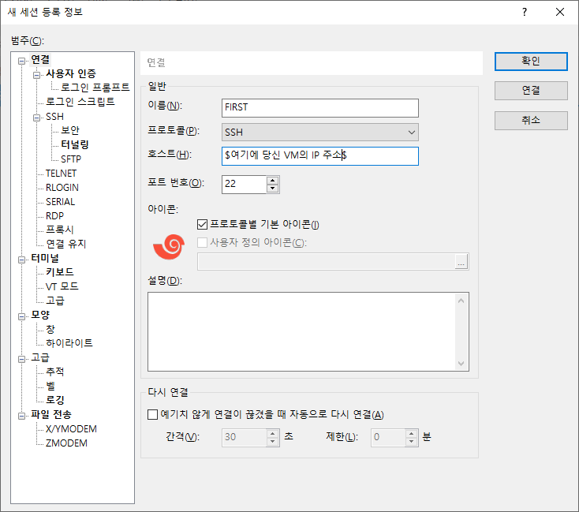
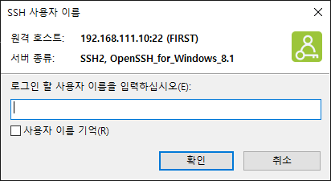
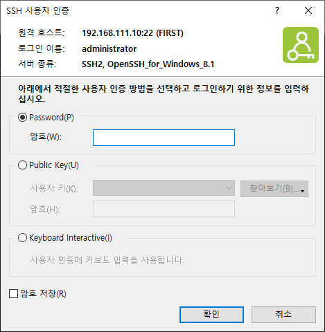
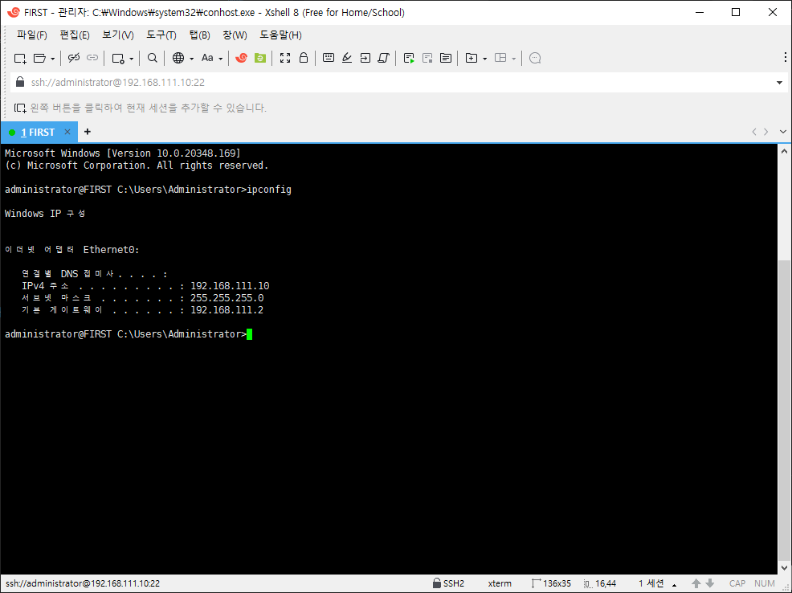
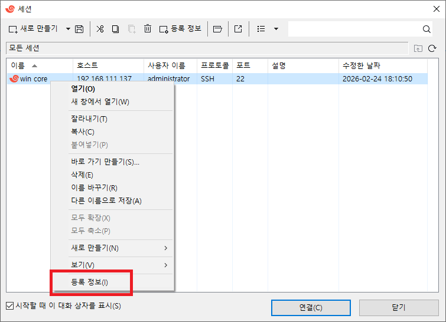
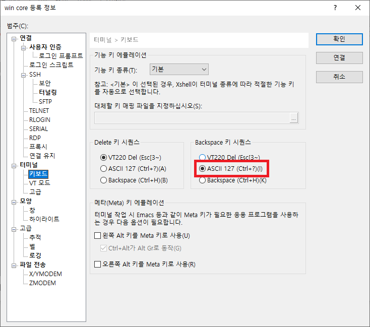
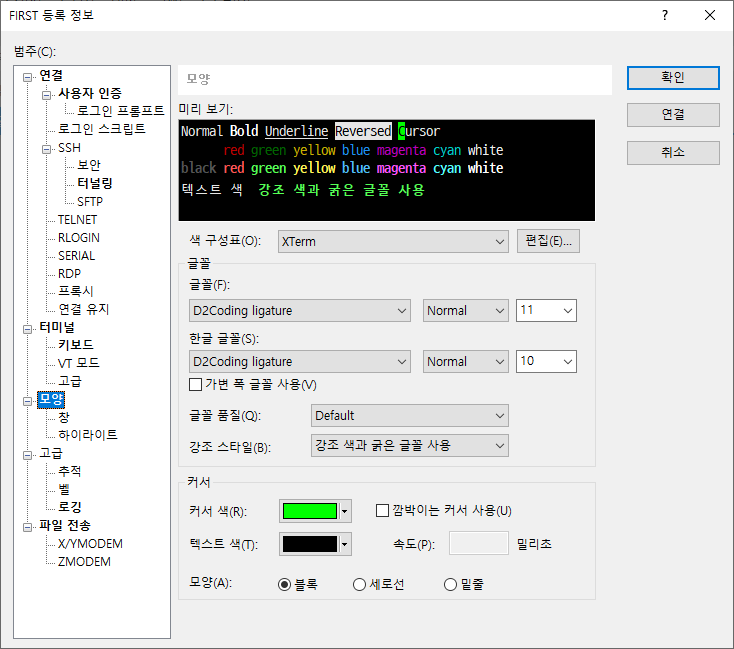

# 2026-02-25-XShell

## VMware의 FIRST를 XShell로 연결하기

0. `Windows Server`에 `Xshell`로 접속하려면 해당 VM 내에서 SSH 서버 서비스가 활성화되어 있어야 한다. 보통 `Windows`는 기본적으로 SSH가 꺼져 있다.

1. VM(FIRST)의 파워쉘(PowerShell)에서 아래 명령어를 입력  

    ```ps
    Get-Service -Name sshd
    ```  

    만약 `서비스 이름을 찾을 수 없다` 같은 메세지가 나온다면 안깔린것이므로 OpenSSH 서버 기능을 추가 설치해야함

2. VM의 PowerShell창을 관리자 권한으로 열고 아래 명령어를 순서대로 입력.

    설치 가능 여부 확인

    ```ps
    Get-WindowsCapability -Online | Where-Object Name -like 'OpenSSH.Server*'
    ```  

    (결과에 State : NotPresent라고 나오면 설치가 필요한 상태.)

    설치 진행:

    ```ps
    PowerShell
    Add-WindowsCapability -Online -Name OpenSSH.Server~~~~0.0.1.0
    ```

    > **✋ 여기서 잠깐!**
    >
    > 만약 위 설치 명령어를 입력했는데  
    >
    >> `Add-WindowsCapability : 서비스를 사용할 수 없거나 서비스와 연관되어 사용 가능한 장치가 없기 때문에 서비스를 시작할 수 없습니다.`  
    >
    > 와 같은 메세지가 나온다면  
    >
    > ~~아마 COMException 오류일텐데 이는 보통 Windows Update 서비스가 꺼져 있거나, 시스템의 업데이트 구성 요소에 문제가 있을 때 발생한다.~~
    >
    > 아래 순서대로 입력하자.
    >
    > 1. 필수 서비스 활성화 (PowerShell 관리자 권한)  
    > Windows Update 관련 서비스가 중지되어 있는지 확인
    >
    >> ```ps
    >> # Windows Update 서비스 시작 및 자동 설정
    >>
    >> Set-Service -Name wuauserv -StartupType Automatic Start-Service wuauserv
    >>
    >> # 설치를 돕는 관련 서비스 시작
    >>
    >> Start-Service bits
    >> Start-Service trustedinstaller
    >> ```
    >
    > 1. 이후 설치 명령어를 다시 입력한다.
    >
    >>```ps
    >>Add-WindowsCapability -Online -Name OpenSSH.Server~~~~0.0.1.0
    >>```
    >

3. SSH 서비스 시작 및 자동 실행 설정

    설치가 완료 후, 서비스를 실행하고 윈도우가 켜질 때마다 자동으로 실행되도록 설정.

    ```ps
    # 서비스 시작
    Start-Service sshd

    # 자동 실행 설정
    Set-Service -Name sshd -StartupType 'Automatic'

    # 확인 (Status가 'Running'이어야 함)
    Get-Service sshd
    ```

4. 방화벽 규칙 확인

    설치 시 자동으로 규칙이 생성되지만, 확실히 하기 위해 아래 명령어로 22번 포트가 허용되었는지 확인.

    ```ps
    Get-NetFirewallRule -Name *OpenSSH-Server* | select Name, DisplayName, Enabled
    ```

    (Enabled 값이 True로 나오면 정상.)

5. XShell에서 연결

    연결할 VMWare ip가 뭔지 알아야함 `ipcofig`을 입력해서 알아보자

    

    여기서는 `192.168.111.10`이다.

    `XShell`으로 돌아와 `파일 > 새로만들기`에서 아래와 같이 입력

    

    입력 후 우측 상단 `확인`을 누르면 아래와 같은 입력창이 뜬다.

    

    아마 `administrator`일텐데 잘 모르겠으면 VM(FIRST)의 cmd에서 `whoami` 명령어로 확인

    그러면 아래와 같이 비밀번호 입력창이 뜨는데

    

    `암호` 부분에 각자 VM에서 설정한 로그인 암호를 입력하면 된다.

    

    그럼 위와같이 XShell에서 잘 연결된것을 확인할 수 있다.

---

## 백스페이스 입력시 단어단위로 모두 지워지는 문제가 있다면?

연결이 되어있다면 연결을 해제한 후 해당 세션 우클릭해서 `등록정보`로 들어간다.



`터미널 > 키보드` 로 들어가서 ASCII 127로 변경하면 해결된다.



---

## 폰트 바꾸고 싶으면?

`등록정보 > 모양 > 글꼴` 에서 변경



원하는 폰트가 있으면 먼저 설치하고 들어오면 된다.
**저는 개쩌는 `D2Coding` 폰트로 했어요**

---
