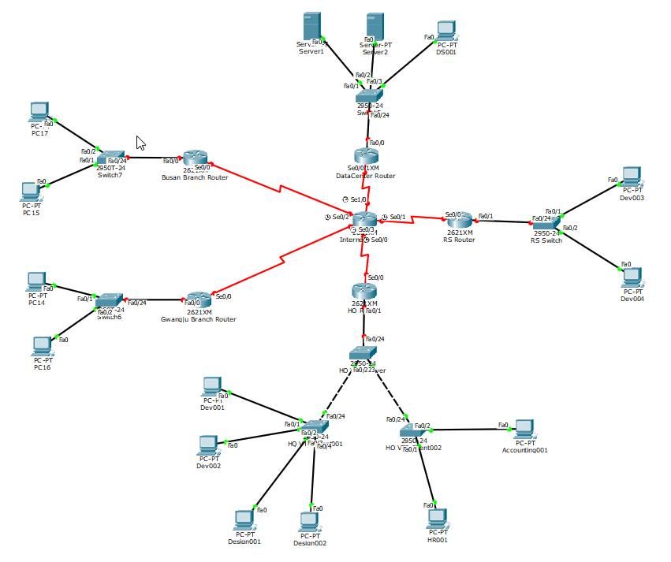

# 2026-03-06-네트워크_실습_시나리오

## 🏢 기업 네트워크 기반 실습 시나리오

### 회사 상황

중소 IT 회사 **MEGA gloval Tech**의 사내 네트워크를 구축하는 상황이다.

본사와 일부 지사 부서는 **네트워크를 분리(VLAN)** 해야 하지만
서버 접근을 위해 **Inter-VLAN 통신**이 필요하다.

회사는 **본사 + 연구소 + 데이터센터 + 지사(부산,광주) 구조**로 되어 있다.

#### 본사(HQ)

|부서|VLAN|이름|네트워크id|
|----|-------|-------|------|
|개발팀|VLAN 10|dev|10.10.10.0/24|
|디자인팀|VLAN 20|design|10.10.20.0/24|
|인사팀|VLAN 30|hr|10.10.30.0/24|
|회계팀|VLAN 40|accounting|10.10.40.0/24|

#### 지사(Branch)

|부서|VLAN|이름|
|----|-------|-------|
|영업팀|VLAN 50||
|마케팅팀|VLAN 60|네트워크 관리|

---

### 토폴로지 구조




---

# 🧱 장비 구성

| 장비  | 역할                       |
| --- | ------------------------ |
| R1  | ISP 연결 Router            |
| R2  | 사내 Router (Inter-VLAN)   |
| SW1 | Core Switch (VTP Server) |
| SW2 | Access Switch            |
| SW3 | Access Switch            |

---

# 🧩 VLAN 설계

| VLAN | 이름     | 네트워크          |
| ---- | ------ | ------------- |
| 10   | DEV    | 10.10.10.0/24 |
| 20   | DESIGN | 10.10.20.0/24 |
| 30   | HR     | 10.10.30.0/24 |
| 40   | SERVER | 10.10.40.0/24 |
| 99   | MGMT   | 10.10.99.0/24 |

---

# 1️⃣ VTP 설정

### SW1 (VTP Server)

```
vtp domain ABC
vtp mode server
vtp password cisco
```

VLAN 생성

```
vlan 10
name DEV

vlan 20
name DESIGN

vlan 30
name HR

vlan 40
name SERVER

vlan 99
name MGMT
```

---

### SW2 / SW3 (VTP Client)

```
vtp domain ABC
vtp mode client
vtp password cisco
```

---

# 2️⃣ Trunk 설정

```
interface g0/1
switchport mode trunk
```

(SW1 ↔ SW2 / SW3)

---

# 3️⃣ Access Port 설정

예:

```
interface f0/1
switchport mode access
switchport access vlan 10
```

PC 연결

---

# 4️⃣ Inter-VLAN Routing (Router-on-a-Stick)

R2

```
interface g0/0
no shutdown
```

Sub-interface

```
interface g0/0.10
encapsulation dot1Q 10
ip address 10.10.10.1 255.255.255.0

interface g0/0.20
encapsulation dot1Q 20
ip address 10.10.20.1 255.255.255.0

interface g0/0.30
encapsulation dot1Q 30
ip address 10.10.30.1 255.255.255.0

interface g0/0.40
encapsulation dot1Q 40
ip address 10.10.40.1 255.255.255.0
```

각 VLAN의 **Gateway 역할**

---

# 5️⃣ Static Routing

본사 R1 ↔ 내부 R2

예:

R1

```
ip route 10.10.0.0 255.255.0.0 192.168.1.2
```

R2

```
ip route 0.0.0.0 0.0.0.0 192.168.1.1
```

---

# 6️⃣ RIP 설정 (지사 추가 시)

지사 Router R3 추가

```
[R3]
   |
  SW4
```

R2

```
router rip
version 2
network 10.0.0.0
no auto-summary
```

R3

```
router rip
version 2
network 10.0.0.0
no auto-summary
```

---

# 🧪 실습 목표

### 1️⃣ VLAN 분리 확인

```
ping 다른 VLAN
→ 실패
```

---

### 2️⃣ Inter-VLAN 확인

```
ping gateway
ping 다른 VLAN PC
→ 성공
```

---

### 3️⃣ RIP 확인

```
show ip route
```

```
R
```

표시 확인

---

### 4️⃣ VTP 확인

```
show vlan brief
```

SW2 / SW3에 VLAN 자동 생성 확인

---

# 🔥 실제 네트워크 트러블슈팅 연습

일부러 문제 만들기

### 문제1

```
VLAN 안보임
```

원인

```
VTP domain mismatch
```

---

### 문제2

```
VLAN 간 ping 안됨
```

원인

```
encapsulation dot1Q 누락
```

---

### 문제3

```
일부 VLAN만 통신 안됨
```

원인

```
trunk allowed vlan
```

---

# 💡 이 토폴로지가 좋은 이유

이 실습 하나로

* VLAN
* VTP
* Trunk
* Inter-VLAN
* Static Routing
* Dynamic Routing (RIP)
* Router-on-a-Stick
* 실제 트러블슈팅

**CCNA 핵심 60%를 한 번에 연습 가능**

---

원하면 내가 **Packet Tracer용 완성 토폴로지**도 만들어 줄게.

예를 들면

* **CCNA 실습 끝판왕 토폴로지 (Router 4 + Switch 4)**
* **실제 기업 네트워크 구조**
* **시험 대비 트러블슈팅 시나리오 10개**

이거 만들어주면 **네트워크 실력 진짜 빨리 는다.**
