# 2026-03-10-저장소공간

## 개념

저장소 공간(Storage Space)은 여러개의 물리적인 디스크를 하나로 합쳐서 논리적인 디스트로 제공하게 하는 기능이다.

## GUI

교재 실습 참고

---

## Powershell

Windows Server 2022에서 **Storage Spaces를 이용해 RAID 1+0(미러 + 스트라이프)** 형태를 PowerShell로 구성

(Windows Server는 전통적인 RAID10 메뉴가 없지만 **Storage Spaces + Mirror + Column 구조**로 구현)

---

### 1. VM에 가상디스크 추가  

[여기 참고](/2026-02-25/2026-02-25-VMWare_HDD_Setting.md)

### 2. `Get-PhysicalDisk` 명령어로 Storage Pool에 사용할 디스크 상태를 확인

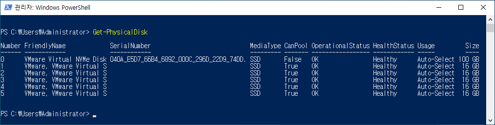

```Powershell
Get-PhysicalDisk

# 만약 Storage Pool에 추가 가능한 디스크만 확인하고 싶으면 아래 명령어 입력
Get-PhysicalDisk | Where-Object CanPool -eq $True
```

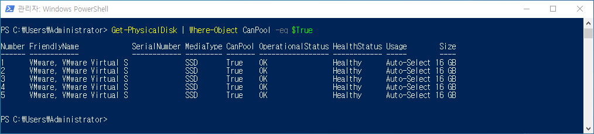

### 3. Storage Pool 생성

스토리지 서브시스템 확인

```powershell
Get-StorageSubSystem
```

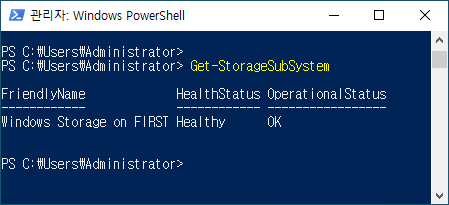

보통 이름이

```powershell
Windows Storage on "당신이설정한서버명"
```

입니다.

Storage Pool 생성 명령어

```powershell
$disks = Get-PhysicalDisk | Where-Object CanPool -eq $True

New-StoragePool `
-FriendlyName "RAID10Pool" `
-StorageSubsystemFriendlyName "Windows Storage*" `
-PhysicalDisks $disks
```
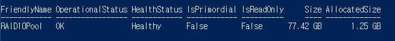

확인

```powershell
Get-StoragePool
```
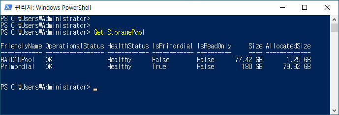

---

### 4. RAID 10 가상 디스크 생성

RAID10은 **Mirror + Column 2** 구조로 만듭니다.

```powershell
New-VirtualDisk `
-StoragePoolFriendlyName "RAID10Pool" `
-FriendlyName "RAID10Disk" `
-ResiliencySettingName Mirror `
-NumberOfColumns 2 `
-UseMaximumSize
```

- 설명

  |옵션|의미|
  |-----------------|-----------|
  |Mirror|RAID1|
  |NumberOfColumns 2|RAID0 스트라이핑|
  |UseMaximumSize|최대 용량 사용|

즉

```
Mirror (RAID1) + Columns 2 (Striping)
= RAID 10
```

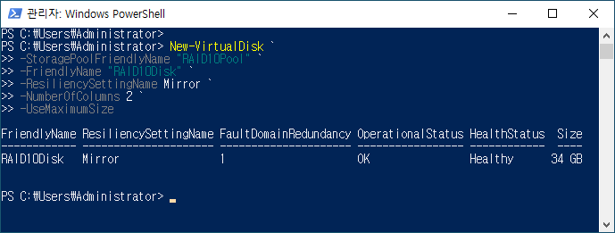

---

### 5. 가상 디스크 확인

```powershell
Get-VirtualDisk
```

상태 확인

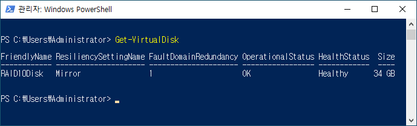

```
HealthStatus : Healthy
OperationalStatus : OK
```

---

### 6. 디스크 Online 전환

먼저 Offline 상태를 Online으로 변경합니다.

```powershell
Set-Disk -Number 6 -IsOffline $false
```

확인

```powershell
Get-Disk
```

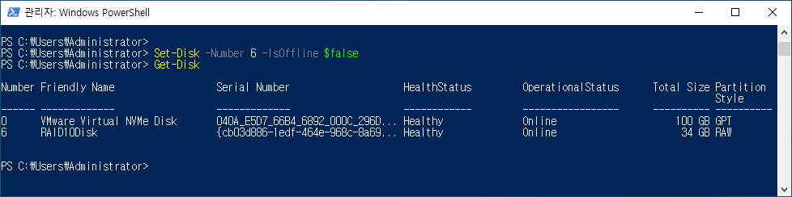

```
OperationalStatus : Online
```

### 7. 디스크 초기화

```powershell
Initialize-Disk -Number 6 -PartitionStyle GPT
```

GPT는 일반적으로 서버에서 권장되는 파티션 방식

### 7. 파티션 생성

전체 용량을 사용하는 파티션을 생성합니다.

```powershell
New-Partition -DiskNumber 6 -UseMaximumSize -DriveLetter E
```

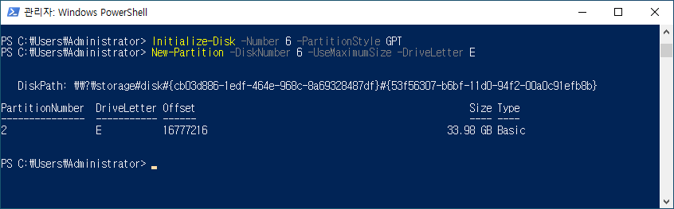

### 8. 파일 시스템 포멧

```powershell
Format-Volume -DriveLetter E -FileSystem NTFS -NewFileSystemLabel RAID10VOL
```

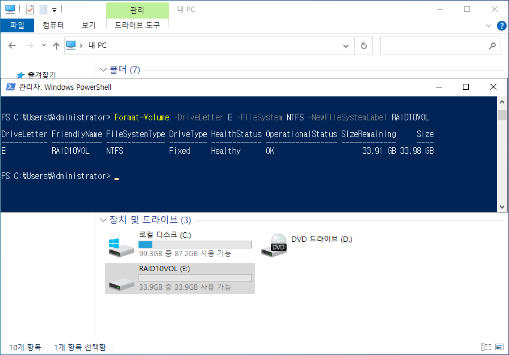

현재 확인되는 상태:

- RAID10VOL (E:) 생성 완료
- FileSystem : NTFS
- HealthStatus : Healthy
- OperationalStatus : OK
- 용량 약 34GB
- 탐색기에서도 드라이브 정상 인식


### 9. 최종 확인

#### Virtual Disk 상태

```powershell
Get-VirtualDisk
```

#### Storage Pool 상태

```powershell
Get-StoragePool
```

#### Physical Disk 상태

```powershell
Get-PhysicalDisk
```

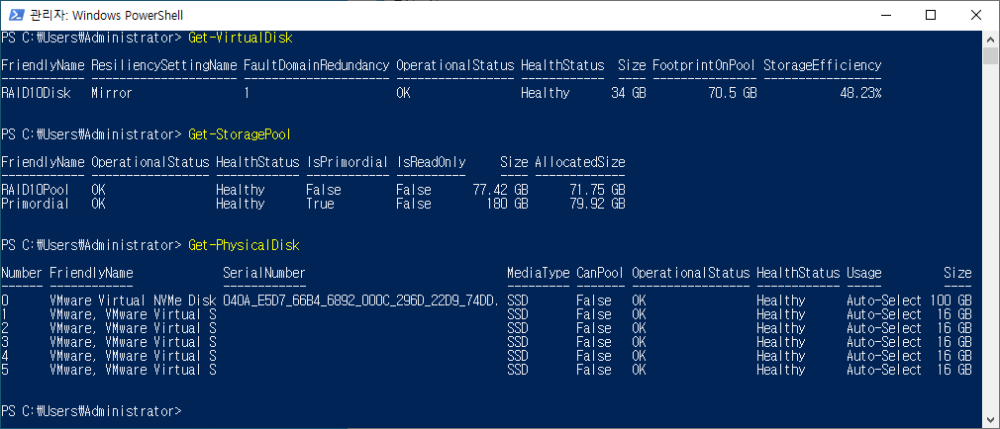

---

### TODO

- **디스크 장애 실습**
- **RAID10 복구 실습(디스크 하나 제거 → 복구)**
