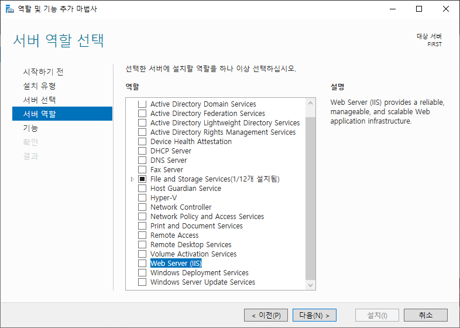
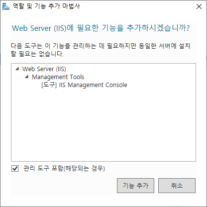
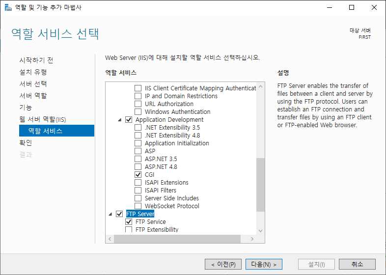

# 2026-03-11-Windows_Server_IIS

## 개념 

IIS(Internet Information Services) Windows Server에 내장된 웹,FTP 서버를 말한다.

---

## IIS 설치

`서버관리자` - `관리` - `역할 밎 기능 추가`

`서버 역할` 에서 `Web Server (IIS)` 체크

`기능 추가` 버튼 클릭

`기능`은 그대로 `다음` 버튼 눌러 진행

Application Development 확장 

