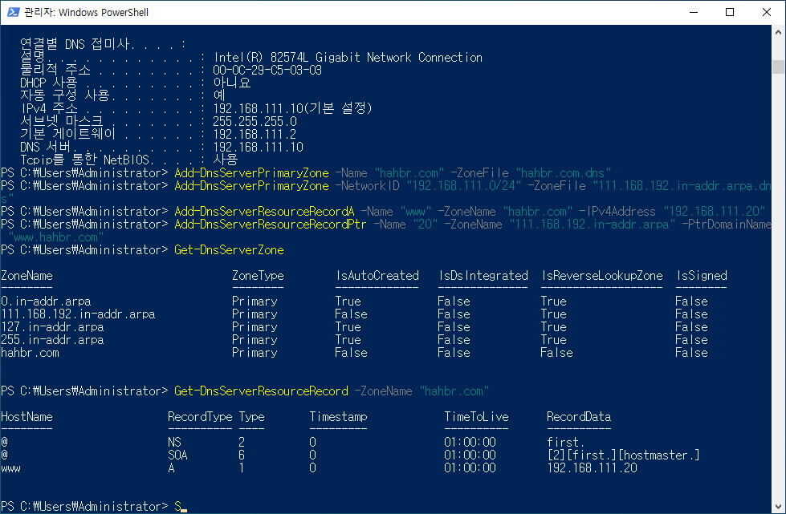

# 2026-03-12-Windows_Server_DNS_IIS_실습

Windows Server 2022 환경에서 PowerShell 기반 내부 DNS + IIS 연동 실습 정리

## 1. 실습 개요

이번 실습에서는 다수의 VM으로 구성된 Windows Server 2022 환경에서 내부 DNS 서버를 구축하고, 별도의 IIS 웹 서버와 연동하여 내부 도메인으로 웹 페이지에 접속하는 과정을 진행.

최종 목표는 다음과 같다.

- `FIRST (192.168.111.10)` 를 DNS 서버로 구성
- `SECOND (192.168.111.20)` 를 IIS 웹 서버로 구성
- 내부 도메인 `www.hahbr.com` 으로 웹 서버 접속 가능하게 설정
- 외부 인터넷 도메인도 해석 가능하도록 Forwarder 설정

즉, 사용자는 브라우저에서 IP 주소가 아닌 도메인 이름 `http://www.hahbr.com` 으로 웹 서버에 접속할 수 있어야 한다.

---

## 2. 실습 환경

|역할|서버명|IP 주소|설명|
|---|---|---|---|
|DNS 서버|FIRST|192.168.111.10|내부 DNS 질의 처리|
|IIS 서버|SECOND|192.168.111.20|웹 서비스 제공|
|게이트웨이|-|192.168.111.2|외부 통신용|
|네트워크 대역|-|192.168.111.0/24|내부 실습망|

---

## 3. 처음 확인한 상태

`FIRST` 서버에서 `ipconfig /all` 을 통해 네트워크 설정을 확인했다.

당시 핵심 상태는 다음과 같았다.

- 호스트 이름: `FIRST`
- IP 주소: `192.168.111.10`
- 기본 게이트웨이: `192.168.111.2`
- DNS 서버: `192.168.111.2`

여기서 중요한 점은 **DNS 서버 구축 대상인 FIRST가 자기 자신이 아니라 다른 DNS 서버를 바라보고 있었다는 것**이다.

DNS 서버를 직접 운영하려면, 최소한 해당 서버가 **자기 자신을 DNS 서버로 사용하도록 설정**하는 것이 기본이다. 그래야 자신이 보유한 존(zone)과 레코드(record)를 기준으로 이름 해석을 수행할 수 있다.

---

## 4. DNS 서버 사전 점검을 먼저 한 이유

정방향 존, 역방향 존을 만들기 전에 바로 설정으로 들어가지 않고, 먼저 다음 요소를 점검했다.

- DNS 역할 설치 여부
- DNS 서비스 실행 여부
- 방화벽 허용 여부
- 53번 포트 리스닝 여부

이 과정을 먼저 한 이유는, **존을 잘 만들어도 서비스나 포트가 준비되지 않으면 실제 질의를 처리할 수 없기 때문**이다.

즉, 설정 이전에 인프라가 살아 있는지 확인하는 단계였다.

---

## 5. DNS 역할 설치 여부 확인

먼저 `FIRST` 에서 DNS 역할이 설치되어 있는지 확인했다.

```powershell
Get-WindowsFeature DNS
```

**왜 이 명령어를 썼는가**

이 명령어는 Windows Server에 특정 역할(Role)이나 기능(Feature)이 설치되어 있는지 확인할 때 사용한다.

```text
[X] DNS Server   Installed
```

위와 같이 나오면, DNS 서버 역할은 이미 설치된 상태이다.

만약 아래와 같으면

```text
[ ] DNS Server   Available
```

설치가 안된것이니 아래 명령어를 입력하여 설차한다.

```ps
Install-WindowsFeature DNS -IncludeManagementTools
```

**알게 된 점**

DNS 서버가 동작하려면 단순히 네트워크가 된다고 끝이 아니라, **Windows Server에 DNS 역할 자체가 설치되어 있어야 한다.**

---

## 6. 방화벽 규칙 확인

DNS 역할이 설치되어 있더라도, 방화벽에서 DNS 요청이 차단되면 클라이언트가 이름 질의를 보낼 수 없다. 그래서 방화벽 규칙을 확인했다.

처음에는 아래 명령을 사용했다.

```powershell
Get-NetFirewallRule -DisplayGroup "DNS Server"
```

그런데 한국어 Windows Server 환경에서는 `"DNS Server"` 가 아니라 `"DNS 서비스"` 로 표시되어 있어서 바로 찾지 못했다.

이후 다음 명령으로 관련 규칙을 확인했다.

```powershell
Get-NetFirewallRule | Where-Object {$_.DisplayGroup -like "*DNS*"} |
Select-Object DisplayName, DisplayGroup, Enabled, Direction, Action
```

**왜 이 명령어를 썼는가**

- `Get-NetFirewallRule`: 방화벽 규칙 전체 조회
- `Where-Object`: 조건에 맞는 규칙만 필터링
- `DisplayGroup -like "*DNS*"`: DNS 관련 규칙만 찾기
- `Select-Object`: 필요한 항목만 보기 좋게 출력

### 확인 결과

다음과 같은 DNS 관련 규칙이 활성화되어 있었다.

- `DNS(UDP, 수신)`
- `DNS(TCP, 수신)`
- `모든 송신(UDP)`
- `모든 송신(TCP)`

**알게 된 점**

DNS 서버는 단순히 UDP만 쓰는 것이 아니라, 상황에 따라 TCP도 사용한다.
따라서 **TCP/UDP 53 포트가 모두 허용되어 있어야 안정적으로 동작**한다.

---

## 7. DNS 서비스 실행 여부 확인

다음으로 DNS 서비스가 실제로 실행 중인지 확인했다.

```powershell
Get-Service DNS
```

결과:

```text
Status   Name   DisplayName
Running  DNS    DNS Server
```

**왜 이 명령어를 썼는가**

DNS 역할이 설치되어 있어도, 서비스가 중지되어 있으면 요청을 처리할 수 없다.
그래서 **역할 설치 여부와 서비스 실행 여부는 별도로 확인해야 한다.**

**알게 된 점**

`Installed` 와 `Running` 은 다르다.

- `Installed`: 기능이 설치된 상태
- `Running`: 실제로 서비스가 동작 중인 상태

즉, 설치되어 있어도 실행되지 않으면 DNS 서버로 기능할 수 없다.

---

## 8. 53번 포트 리스닝 확인

다음으로 DNS 서버가 실제로 53번 포트에서 요청을 받을 준비가 되어 있는지 확인했다.

```powershell
netstat -ano | findstr :53
```

결과에서 핵심은 다음과 같았다.

```text
TCP    127.0.0.1:53           LISTENING
TCP    192.168.111.10:53      LISTENING
UDP    127.0.0.1:53
UDP    192.168.111.10:53
```

**왜 이 명령어를 썼는가**

- `netstat -ano`: 현재 열려 있는 포트와 프로세스 정보 확인
- `findstr :53`: 53번 포트만 필터링

즉, **DNS 서비스가 TCP/UDP 53번에서 실제로 대기 중인지 확인하기 위해** 사용했다.

**알게 된 점**

- `Get-Service DNS` 가 Running 이어도
- 실제 포트 리스닝 상태까지 확인해야 더 정확하다.

즉, **서비스 상태 확인과 포트 상태 확인은 서로 보완 관계**다.

---

## 9. FIRST 서버의 DNS 서버 주소를 자기 자신으로 변경

초기 상태에서 `FIRST` 의 DNS 서버는 `192.168.111.2` 였다.
하지만 DNS 서버를 직접 운영하려면 자기 자신을 DNS 서버로 바라보도록 바꾸는 것이 맞다.

그래서 다음 명령을 사용했다.

```powershell
Set-DnsClientServerAddress -InterfaceAlias "Ethernet0" -ServerAddresses 192.168.111.10
```

또는 루프백 주소를 사용할 수도 있다.

```powershell
Set-DnsClientServerAddress -InterfaceAlias "Ethernet0" -ServerAddresses 127.0.0.1
```

**왜 이 명령어를 썼는가**

- `Set-DnsClientServerAddress`: NIC의 DNS 서버 주소 설정
- `-InterfaceAlias "Ethernet0"`: 설정할 네트워크 어댑터 지정
- `-ServerAddresses 192.168.111.10`: 새 DNS 서버 주소 지정

**알게 된 점**

DNS 서버 자신이 자기 DNS를 보지 않으면, 내부 존을 만들더라도 해당 서버가 그 존을 기준으로 질의하지 않을 수 있다.
따라서 **DNS 서버 본인도 자기 자신을 DNS 서버로 설정하는 것이 핵심**이다.

---

## 10. Forwarder 설정

외부 인터넷 도메인도 해석할 수 있게 하기 위해 Forwarder를 추가했다.

```powershell
Add-DnsServerForwarder -IPAddress 8.8.8.8,1.1.1.1
```

**왜 이 명령어를 썼는가**

내부 DNS 서버는 자신이 직접 관리하는 존에 대해서만 기본적으로 잘 응답한다.
예를 들어:

- `www.hahbr.com` → 내부 존이므로 직접 응답 가능
- `google.com` → 내부 존이 아니므로 직접 모름

이때 Forwarder를 설정하면, 내부 DNS 서버가 모르는 외부 도메인은 지정한 외부 DNS 서버에 대신 물어볼 수 있다.

### 의미

- `8.8.8.8` → Google Public DNS
- `1.1.1.1` → Cloudflare DNS

**알게 된 점**

Forwarder는 **내부 존 정보가 없는 외부 도메인을 대신 조회해 주는 중계 역할**이다.
즉, DNS 서버가 모르는 질의를 상위 또는 외부 DNS에 전달하는 구조다.

---

## 11. 정방향 조회 영역(Forward Lookup Zone) 생성

내부 도메인 `hahbr.com` 을 관리하기 위해 정방향 존을 생성했다.

```powershell
Add-DnsServerPrimaryZone -Name "hahbr.com" -ZoneFile "hahbr.com.dns"
```

**왜 이 명령어를 썼는가**

- `Add-DnsServerPrimaryZone`: 기본(Primary) 존 생성
- `-Name "hahbr.com"`: 생성할 도메인 이름
- `-ZoneFile "hahbr.com.dns"`: 존 정보를 저장할 파일 이름

### 정방향 존이란?

정방향 존은 **이름 → IP 주소** 를 관리하는 영역이다.

예를 들어:

- `www.hahbr.com` → `192.168.111.20`

같은 해석을 담당한다.

**알게 된 점**

DNS의 핵심 기능 중 하나는 **사람이 읽기 쉬운 이름을 IP 주소로 바꾸는 것**이고, 이 역할을 정방향 존이 담당한다.

---

## 12. 역방향 조회 영역(Reverse Lookup Zone) 생성

다음으로 역방향 조회를 위해 Reverse Zone 을 만들었다.

처음에는 아래 명령을 사용했다.

```powershell
Add-DnsServerPrimaryZone -NetworkID "192.168.111.0/24"
```

하지만 다음 오류가 발생했다.

```text
지정한 명명된 매개 변수를 사용하여 매개 변수 집합을 확인할 수 없습니다.
```

이후 아래처럼 `-ZoneFile` 을 함께 지정하여 해결했다.

```powershell
Add-DnsServerPrimaryZone -NetworkID "192.168.111.0/24" -ZoneFile "111.168.192.in-addr.arpa.dns"
```

**왜 이 명령어를 썼는가**

역방향 존은 **IP 주소 → 이름** 을 확인할 때 사용된다.

예를 들어:

- `192.168.111.20` → `www.hahbr.com`

### 왜 처음 명령은 실패했는가

내 실습 환경에서는 `-NetworkID` 만 사용했을 때 파라미터 집합 관련 오류가 발생했다.
그래서 파일 기반 존으로 만들겠다는 의미로 `-ZoneFile` 을 함께 지정해 해결했다.

**알게 된 점**

PowerShell 명령은 단순히 문법만 아는 것이 아니라, **어떤 매개변수 조합이 하나의 파라미터 집합을 이루는지 이해해야 한다.**

---

## 13. A 레코드 생성

`SECOND` 서버의 IIS 웹 사이트를 `www.hahbr.com` 으로 접속하기 위해 A 레코드를 추가했다.

```powershell
Add-DnsServerResourceRecordA -Name "www" -ZoneName "hahbr.com" -IPv4Address "192.168.111.20"
```

**왜 이 명령어를 썼는가**

- `Add-DnsServerResourceRecordA`: A 레코드 추가
- `-Name "www"`: 호스트 이름
- `-ZoneName "hahbr.com"`: 어느 존에 추가할지
- `-IPv4Address "192.168.111.20"`: 연결할 대상 IP

즉, 최종적으로 다음 의미가 된다.

- `www.hahbr.com` → `192.168.111.20`

**알게 된 점**

존만 만들어서는 이름 해석이 되지 않는다.
**존 안에 실제 호스트 레코드가 있어야 질의에 응답할 수 있다.**

---

## 14. PTR 레코드 생성

역방향 조회도 가능하게 하기 위해 PTR 레코드를 추가했다.

```powershell
Add-DnsServerResourceRecordPtr -Name "20" -ZoneName "111.168.192.in-addr.arpa" -PtrDomainName "www.hahbr.com"
```

**왜 이 명령어를 썼는가**

PTR 레코드는 IP 주소 마지막 옥텟을 기준으로 역방향 이름 해석을 정의한다.

- `192.168.111.20`
- Reverse Zone: `111.168.192.in-addr.arpa`
- `20` → `www.hahbr.com`

**알게 된 점**

정방향 조회(A 레코드)와 역방향 조회(PTR 레코드)는 서로 다른 목적을 가진다.

- A 레코드: 이름 → IP
- PTR 레코드: IP → 이름

---

## 15. 존과 레코드 생성 결과 확인

존 생성 후 아래 명령으로 정상 생성 여부를 확인했다.

```powershell
Get-DnsServerZone
```

레코드 생성 후에는 아래 명령으로 `hahbr.com` 존 내부 레코드를 확인했다.

```powershell
Get-DnsServerResourceRecord -ZoneName "hahbr.com"
```



**왜 이 명령어를 썼는가**

설정 명령을 실행한 뒤에는 항상 실제 반영 여부를 확인해야 한다.
특히 DNS는 설정 직후 결과가 눈으로 바로 보이지 않는 경우가 많아서, **존과 레코드가 정확히 생성되었는지 별도 확인하는 습관이 중요**하다.

---

## 16. DNS 이름 해석 테스트

`FIRST` 서버에서 다음 명령으로 정방향 이름 해석을 확인했다.

```powershell
Resolve-DnsName www.hahbr.com
```

또는

```cmd
nslookup www.hahbr.com
```

정상 결과:

```text
이름:    www.hahbr.com
Address: 192.168.111.20
```

**왜 이 명령어를 썼는가**

- `Resolve-DnsName`: Windows PowerShell 기반 DNS 질의 도구
- `nslookup`: 전통적인 DNS 질의 도구

둘 다 이름이 올바르게 IP로 해석되는지 확인할 때 사용한다.

**알게 된 점**

`Resolve-DnsName` 과 `nslookup` 은 둘 다 DNS 확인 용도지만,
PowerShell 환경에서는 `Resolve-DnsName` 이 좀 더 스크립트 친화적이다.

---

## 17. SECOND 서버에 IIS 설치

DNS 연동 대상 웹 서버인 `SECOND (192.168.111.20)` 에 IIS를 설치했다.

설치 여부 확인:

```powershell
 
```

설치:

```powershell
Install-WindowsFeature Web-Server -IncludeManagementTools
```

**왜 이 명령어를 썼는가**

- `Web-Server` 는 IIS 역할 이름
- `-IncludeManagementTools` 는 관리 도구까지 함께 설치

**알게 된 점**

Windows Server에서는 GUI 없이도 PowerShell만으로 웹 서버 역할 설치가 가능하다.

---

## 18. IIS 기본 페이지 생성

IIS 설치 후 기본 경로인 `C:\inetpub\wwwroot` 에 테스트용 HTML 파일을 만들었다.

```powershell
@'
<!DOCTYPE html>
<html lang="ko">
<head>
    <meta charset="UTF-8">
    <title>www.hahbr.com</title>
</head>
<body>
    <h1>SECOND IIS 서버입니다</h1>
    <p>Host: www.hahbr.com</p>
    <p>Server IP: 192.168.111.20</p>
</body>
</html>
'@ | Set-Content -Path C:\inetpub\wwwroot\index.html -Encoding UTF8
```

**왜 이 명령어를 썼는가**

PowerShell의 here-string(`@' ... '@`) 을 사용하면 여러 줄의 HTML을 한 번에 문자열로 만들 수 있다.
그 결과를 `Set-Content` 로 파일로 저장해 웹 페이지를 생성했다.

**알게 된 점**

PowerShell은 단순 명령 실행 도구가 아니라, **텍스트 파일 생성과 배포 작업에도 매우 유용하다.**

---

## 19. IIS 서비스와 사이트 상태 확인

```powershell
Get-Service W3SVC
Import-Module WebAdministration
Get-Website
```

**왜 이 명령어를 썼는가**

- `W3SVC`: IIS 웹 서비스
- `Import-Module WebAdministration`: IIS 관리용 PowerShell 모듈 로드
- `Get-Website`: 현재 IIS 사이트 상태 확인

**알게 된 점**

IIS도 DNS와 마찬가지로:

- 역할 설치
- 서비스 실행
- 실제 사이트 상태

를 각각 분리해서 확인해야 한다.

---

## 20. IIS 바인딩에 대한 이해

다음 명령으로 사이트 바인딩을 추가할 수 있다.

```powershell
New-WebBinding -Name "Default Web Site" -IPAddress "*" -Port 80 -HostHeader "www.hahbr.com"
```

다만 이번 실습에서는 IP 접속 시 기본 사이트가 이미 열리는 것을 확인했다.

### 왜 IP로도 접속되었는가

기본 사이트는 보통 다음과 같은 기본 바인딩을 가진다.

- `*:80:`

즉,

- 모든 IP
- 80 포트
- Host Header 없음

이 상태이면 `http://192.168.111.20` 으로 접속해도 기본 사이트가 응답한다.

### 그럼 Host Header 바인딩은 왜 필요한가

지금은 사이트가 하나뿐이라 없어도 동작할 수 있다.
하지만 나중에 한 서버에서 여러 사이트를 운영하려면 Host Header 로 구분해야 한다.

예:

- `www.hahbr.com`
- `app.hahbr.com`
- `intra.hahbr.com`

기존 기본 바인딩 `*:80:` 이 그대로 남아 있으면 IP 접속은 계속 가능하다.
도메인 기반으로만 구분하고 싶다면 기본 바인딩을 제거하거나, 사이트를 분리해서 각 Host Header 에 맞게 바인딩을 구성해야 한다.

**알게 된 점**

바인딩은 단순 접속 허용 설정이 아니라,
**어떤 요청을 어떤 사이트가 처리할지 결정하는 기준**이다.

---

## 21. SECOND 서버의 DNS 서버 주소 변경

처음 `SECOND` 에서 `nslookup www.hahbr.com` 을 실행했을 때 다음처럼 나왔다.

```text
서버:    UnKnown
Address:  192.168.111.2
*** UnKnown이(가) www.hahbr.com을(를) 찾을 수 없습니다. Non-existent domain
```

즉, `SECOND` 는 아직 `FIRST` 가 아니라 게이트웨이 측 DNS를 사용하고 있었다.

그래서 다음 명령으로 DNS 서버를 `FIRST` 로 바꿨다.

```powershell
Set-DnsClientServerAddress -InterfaceAlias "Ethernet0" -ServerAddresses 192.168.111.10
```

변경 후 캐시 초기화:

```powershell
ipconfig /flushdns
```

**왜 이 명령어를 썼는가**

웹 서버도 내부 도메인을 해석하려면 **자기 DNS 서버를 FIRST로 바라봐야** 한다.

**알게 된 점**

DNS 서버를 구축해도, 클라이언트나 서버들이 그 DNS를 사용하도록 설정하지 않으면 실제로는 아무 의미가 없다.

---

## 22. DNS와 웹 연결 최종 테스트

`FIRST` 에서 다음 명령으로 DNS와 웹 연결을 함께 점검했다.

```powershell
nslookup www.hahbr.com
Test-NetConnection www.hahbr.com -Port 80
Get-DnsServerResourceRecord -ZoneName "hahbr.com"
```

결과:

- `www.hahbr.com` → `192.168.111.20`
- `TcpTestSucceeded : True`
- `www` A 레코드 존재

**왜 이 명령어를 썼는가**

이 3개는 각각 다른 계층을 확인한다.

- `nslookup` → 이름 해석
- `Test-NetConnection -Port 80` → 네트워크/포트 연결
- `Get-DnsServerResourceRecord` → 실제 DNS 설정 존재 여부

**알게 된 점**

문제를 진단할 때는 한 번에 “안 된다”로 묶지 말고,
다음을 분리해서 봐야 한다.

1. 이름 해석이 되는가
2. 포트 연결이 되는가
3. 실제 설정이 존재하는가

---

## 23. 브라우저에서 검색으로 넘어간 이유

브라우저 주소창에 `www.hahbr.com` 만 입력했을 때 검색으로 넘어가는 현상이 있었다.

실제로는 주소창이 다음처럼 처리된 것이었다.

- `https://www.bing.com/search?q=www.hahbr.com`

### 왜 이런 일이 생겼는가

브라우저는 입력값을 보고:

- URL
- 검색어

중 하나로 해석한다.

이 동작은 브라우저 종류, 기본 검색 엔진, HTTPS 우선 정책에 따라 달라질 수 있다.
이번 실습 환경에서는 `www.hahbr.com` 만 입력했을 때 URL이 아니라 검색어로 처리되었다.

### 해결 방법

재현성 있게 테스트하려면 주소창에 아래처럼 프로토콜까지 포함해 입력하는 것이 안전하다.

```text
http://www.hahbr.com
```

**알게 된 점**

내부 도메인 테스트 시에는 단순 이름만 입력하지 말고,
**`http://` 를 명시해서 URL임을 브라우저에 확실히 알려주는 것이 안전하다.**

---

## 24. 최종적으로 구성된 구조

최종적으로 실습에서 구성한 흐름은 다음과 같다.

1. `FIRST` 에 DNS 서버 역할 설치 및 상태 확인
2. `FIRST` 의 DNS 서버 주소를 자기 자신으로 변경
3. DNS 서비스, 방화벽, 53번 포트 점검
4. Forwarder 설정으로 외부 도메인 질의 가능하게 구성
5. `hahbr.com` 정방향 존 생성
6. `192.168.111.0/24` 역방향 존 생성
7. `www.hahbr.com -> 192.168.111.20` A 레코드 생성
8. `192.168.111.20 -> www.hahbr.com` PTR 레코드 생성
9. `SECOND` 에 IIS 설치
10. `SECOND` 의 기본 페이지 생성
11. `SECOND` 의 DNS 서버 주소를 `FIRST` 로 변경
12. `FIRST` 와 `SECOND` 에서 `nslookup`, `Test-NetConnection` 으로 검증
13. 브라우저에서 `http://www.hahbr.com` 으로 접속

---

## 25. 이번 실습에서 배운 핵심

### 1) DNS 서버 구축은 존 생성부터가 아니라 사전 점검부터다

처음에는 정방향 존, 역방향 존을 바로 만들 생각이었지만, 실제로는 다음이 먼저였다.

- 역할 설치 여부
- 서비스 상태
- 방화벽
- 포트 리스닝

이 순서를 먼저 확인해야 이후 설정이 의미가 있다.

### 2) DNS는 “서버가 존재하는 것”과 “클라이언트가 그 서버를 사용하도록 설정하는 것”이 다르다

DNS 서버를 잘 만들어도, 다른 서버나 클라이언트가 그 DNS를 바라보지 않으면 질의는 계속 다른 곳으로 간다.

### 3) 정방향 존과 역방향 존은 목적이 다르다

- 정방향: 이름 → IP
- 역방향: IP → 이름

둘 다 설정하면 관리와 진단이 더 편해진다.

### 4) 웹 접속 문제는 DNS, 포트, IIS를 분리해서 봐야 한다

- `nslookup` 이 되면 DNS는 정상
- `Test-NetConnection -Port 80` 이 되면 네트워크/포트는 정상
- 그 이후 문제면 IIS 바인딩, 브라우저 입력 방식 등을 봐야 한다

### 5) 브라우저는 내부 도메인을 검색어로 처리할 수 있다

따라서 테스트할 때는 항상 `http://www.hahbr.com` 처럼 프로토콜까지 명시하는 것이 좋다.

---

## 26. 마무리

이번 실습을 통해 PowerShell만으로도 다음 작업을 충분히 수행할 수 있다는 점을 확인했다.

- Windows DNS 서버 구축
- 내부 정방향/역방향 존 생성
- A/PTR 레코드 관리
- Forwarder 설정
- IIS 설치 및 웹 페이지 배포
- 내부 도메인 기반 웹 접속 구성

특히 중요한 것은 단순히 명령어를 외우는 것이 아니라,
**왜 이 명령어를 쓰는지, 이 설정이 전체 구조에서 어떤 역할을 하는지를 같이 이해하는 것**이었다.

이번 실습은 단순한 DNS 설정 실습이 아니라,
**이름 해석 → 웹 서비스 연결 → 클라이언트 접근**까지 이어지는 실제 인프라 흐름을 한 번에 이해하는 데 의미가 있었다.
