# 2026-03-16-Windows_Server_EmailServer

## 개념

E-mail 송수신에서 사용되는 기본적인 프로토콜

- **STMP(Simple Mail Transpfer Protocol)**  
  클라이언트가 메일을 보내거나 E-Mail 서버끼리 메일을 주고받을때 사용

- **POP3(Post Office Protocol)**  
E-Mail 서버에 도착한 메일을 클라이언트로 가져올때 사용

- **IMAP(Internet Mail Access Protocol)**  
POP3와 동일하게 E-Mail 서버에 도착한 메일을 클라언트로 가져올때 사용

## 실습 개요

VMware를 사용하여 E-mail 서버 2대 설치 -> 다른 도메인을 가진 2개의 E-mail 서버
VMware는 원래 사설네트워크지만 여기서는 외부망이라 가정
모든 컴퓨터의 DNS서버는 FIRST(192.168.111.10)으로 통일
DNS 서버는 FIRST에 이미 설치되있다.

|vm|ip|role|
|---|---|-------|
|FIRST|192.168.111.10|DNS서버, first.com 메일서버|
|SECOND|192.168.111.20|second.com 메일서버|
|THIRD|192.168.111.30|메일클라이언트|
|WINCLIENT|192.168.111.000|메일클라이언트|

## 1. DNS 새영역 만들기

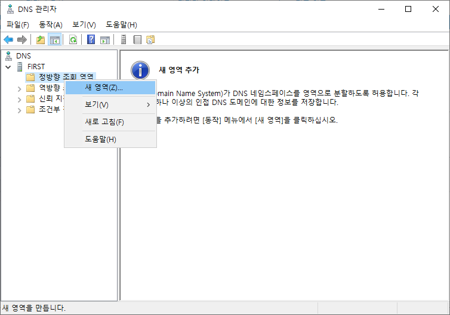

`DNS 관리자` 실행  
`FIRST` -> `정방향 조회 영역` -> 마우스우클릭 후 `새영역` 선택

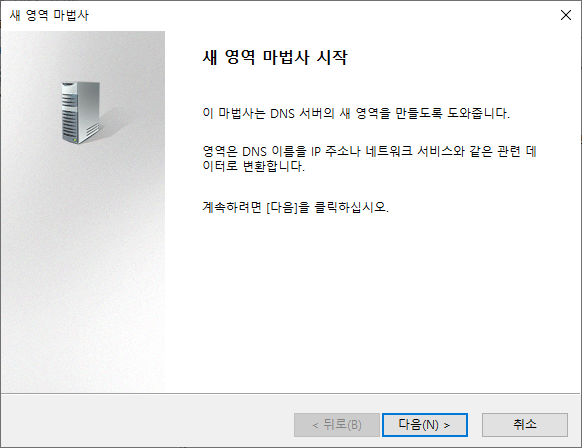  
`다음` 버튼 클릭

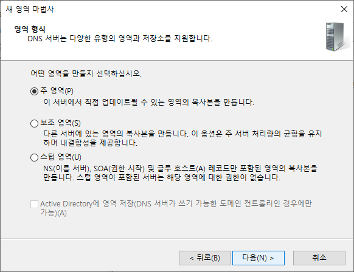  
`주영역` 선택 후 `다음` 클릭

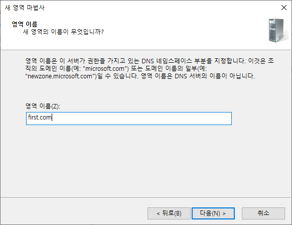  
FIRST Email 서버의 도메인 이름으로 정한 `first.com` 입력

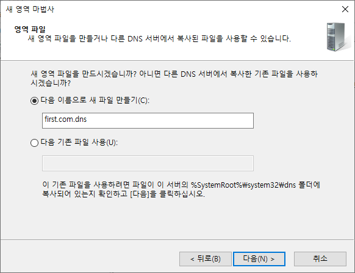  
기본값 그대로 두고 `다음` 클릭

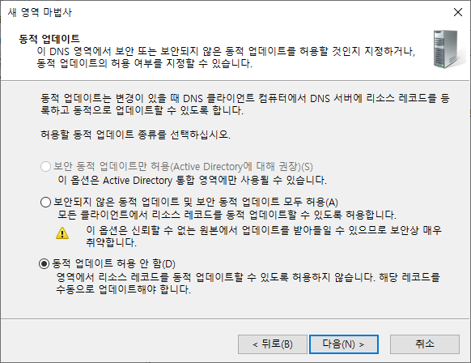  
기본값 그대로 두고 `다음` 클릭

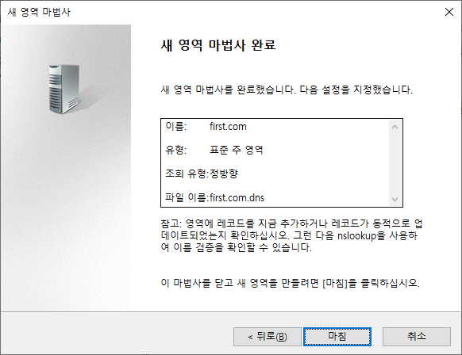
`마침` 클릭해서 새영역 마법사 닫기

다시 DNS 화면에서 왼쪽 `정방향 조회 영역` 확장하고 `first.com` 선택 후 우클릭 `새 호스트 (A 또는 AAAA)` 를 클릭
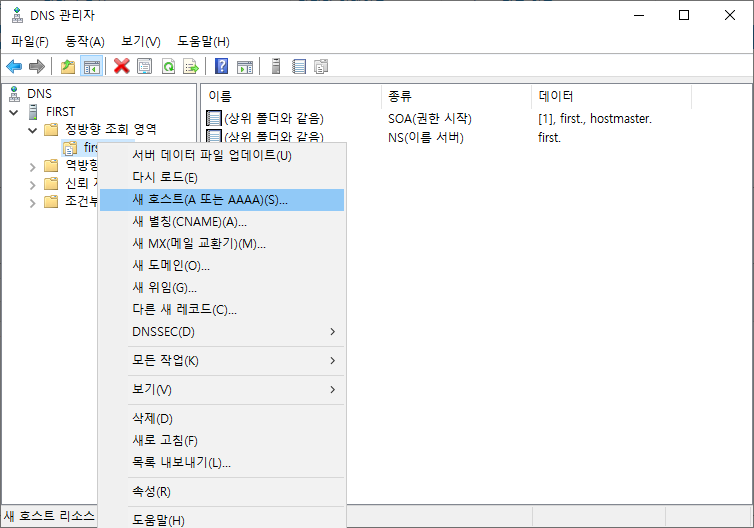

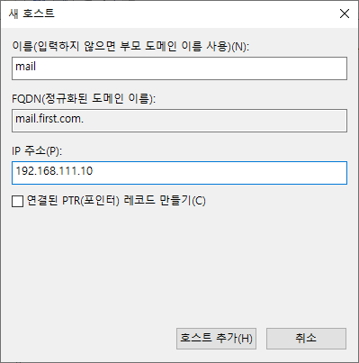  
새 호스트 이름에 `mail` 입력, ip 주소는 FIRST의 ip 인 `192.168.111.10` 입력 후 `호스트 추가` 클릭, 그리고 새 호스트 창 닫기

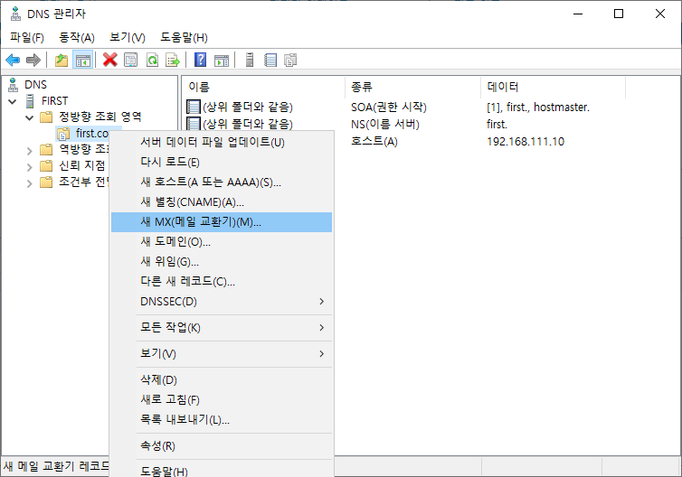  
다시 창 왼쪽 `first.com` 우클릭해서 `새 MX(메일 교환기)` 클릭

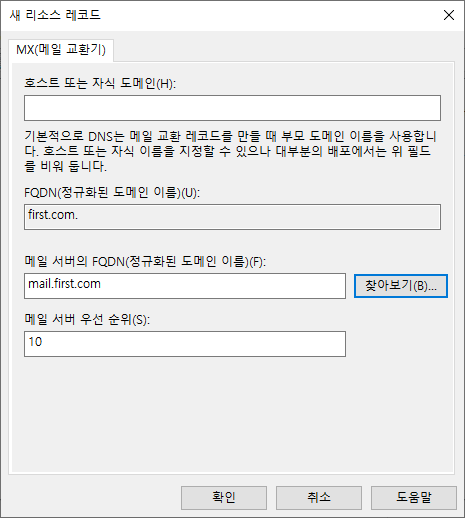  
다른건 다 그대로 두고 `메일 서버의 FQDN(정규화된 도메인 이름)` 만 위에서 설정한 `mail.first.com` 입력 (`찾아보기`눌러서 선택해도 된다.)

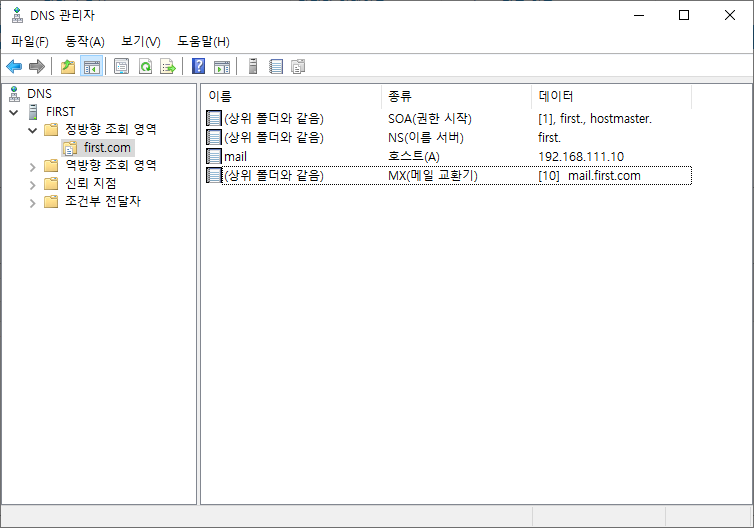
`first.com` 설정을 완료하였다.

지금 까지 한 설정은 **`first.com` 도메인의 메일을 `mail.first.com` 이라는 서버가 받도록 지정했다**는 것이다.

### 호스트(A) 레코드: `mail -> 192.168.111.10`

- `mail.first.com` 이라는 이름이
- 실제로는 `192.168.111.10` 이라는 IP 주소를 가리킨다

#### 의미

누군가 `mail.first.com` 을 조회하면  
DNS가 **192.168.111.10** 을 알려줍니다.

---

### 2. MX 레코드: `first.com -> mail.first.com`

- `@first.com` 으로 오는 메일은
- `mail.first.com` 이라는 메일 서버로 보내라

화면의 `(상위 폴더와 같음)` 은 **도메인 자체**, 즉 `first.com` 을 의미.

따라서 지금 MX 레코드는 사실상 이렇게 해석:

- **`first.com` 의 메일 교환 서버(Mail Exchanger)는 `mail.first.com` 이다**
- 우선순위는 `10`

---

### 전체 흐름으로 보면

1. 누군가 `user@first.com` 으로 메일을 보냄
2. 보내는 쪽 메일 서버가 `first.com` 의 MX 레코드를 조회함
3. DNS가
   **메일 서버는 `mail.first.com` 이다**
   라고 알려줌
4. 다시 `mail.first.com` 의 A 레코드를 조회함
5. DNS가
   **`mail.first.com = 192.168.111.10`**
   이라고 알려줌
6. 결국 보내는 쪽은 **192.168.111.10** 으로 메일을 전달하려고 시도함

---

### 왜 A 레코드와 MX 레코드를 둘 다 만드는가

MX 레코드에는 보통 **IP 주소를 직접 넣지 않고 호스트 이름을 넣는다.**

- MX = “메일 서버 이름이 무엇인가”
- A = “그 이름의 실제 IP가 무엇인가”

이렇게 역할이 나뉜다. 그래서 둘 다 있어야 정상 동작.

---

### 같은 방식으로 `second.com` 메일서버의 DNS 설정을 한다

- ip 주소 : 192.168.111.20

---

## 네트워크 설정 변경

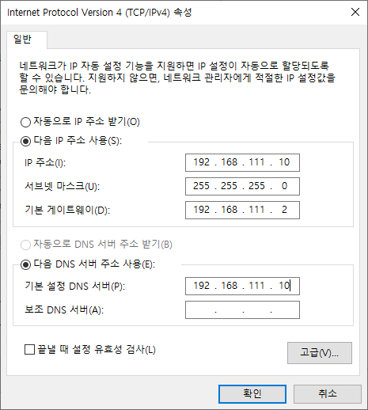
DNS 서버 주소를 FIRST 의 ip 주소인 192.168.111.10 으로 설정한다.

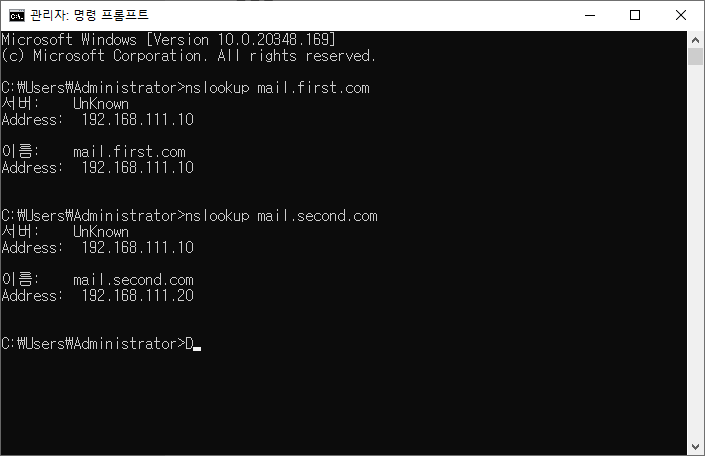
CMD 실행 후 `nslookup` 명령어로 DNS 설정 확인

### 메일 서비스를 위해 포트 허용

열어야 할 포트: 110(pop3) 25(smtp)

`Windows Defender 방화벽` 실행 -> 좌측 `고급 설정` -> `인바운드 규칙` -> 우측 상단 `새 규칙`

그럼 아래와 같은 창이 열린다.

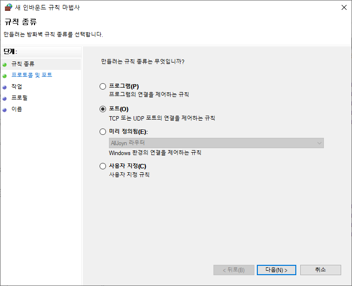  
규칙 종류 `포트` 를 선택하고 `다음`

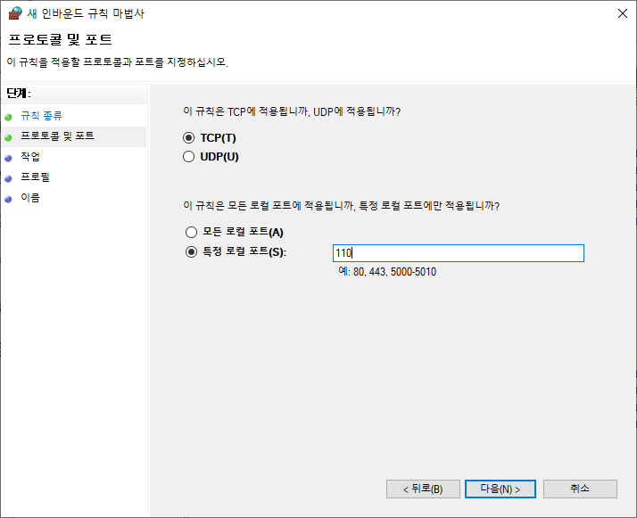  
특정 로컬 포트에 `110` 입력하고 `다음`

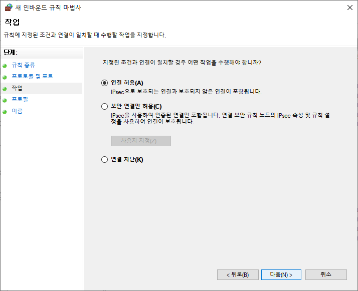  
기본값 그대로 두고 `다음`

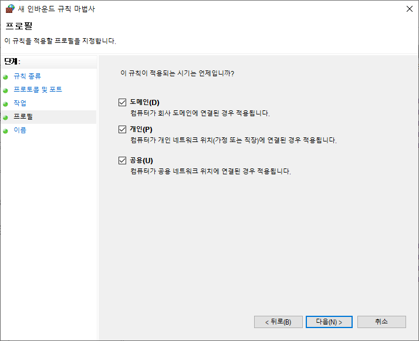
기본값 그대로 두고 `다음`

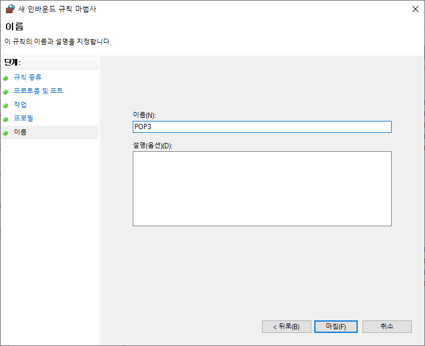
이름에 `POP3` 입력 후 `마침`

**위와 같은방법으로 SMTP 도 25번 포트를 열어준다.**

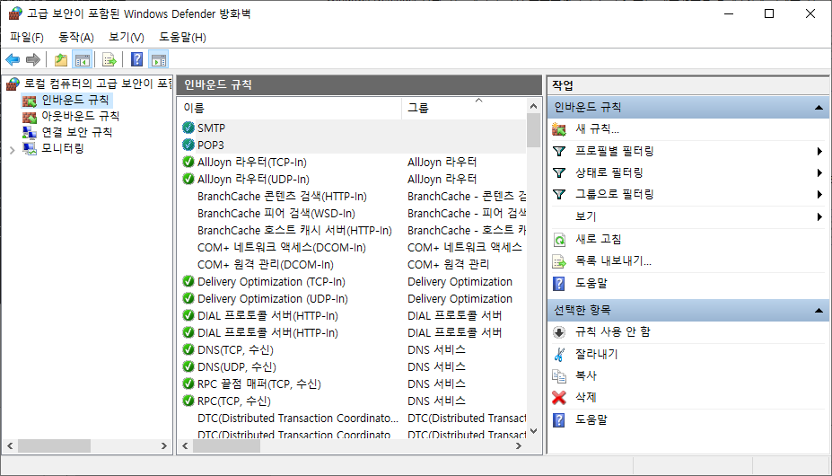
포트 허용까지 완료

## 이메일 서버 설치

[hMailServer(무료 Email 서버)](https://www.hmailserver.com/download)

모두 기본값으로 두고 설치하다가 비밀번호 입력 창이 나오면 비밀번호 입력

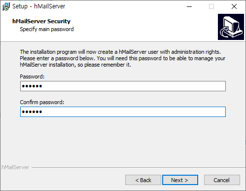  
여기서는 `123456` 으로 한다.

설치가 다 되면 실행

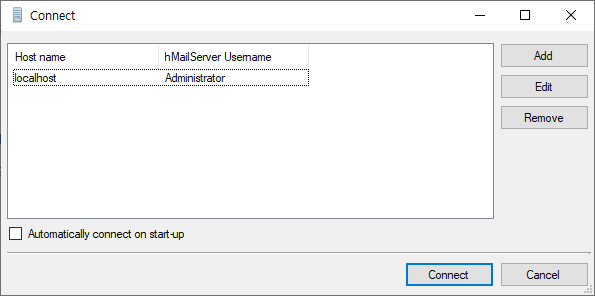  
실행 후 이 창이 뜨면  
`Automatically connect on start-up` 을 체크하고
`Connect` 버튼 클릭해서 암호입력 창이 나오면 아 까 설정한 비밀번호(여기서는 `123456`)을 입력하고 `OK` 버튼을 누른다.

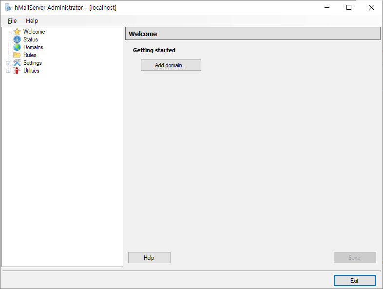

`hMailServer Administrator` 창이 나오면 `Add domain` 클릭

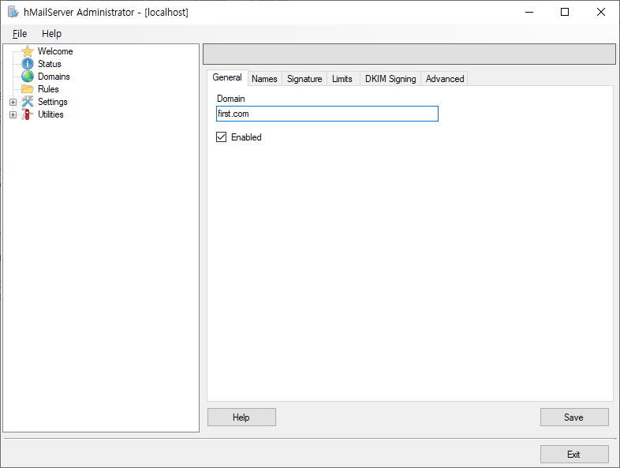  
도메인에 `first.com` 을 입력 후 `Save` 버튼 클릭

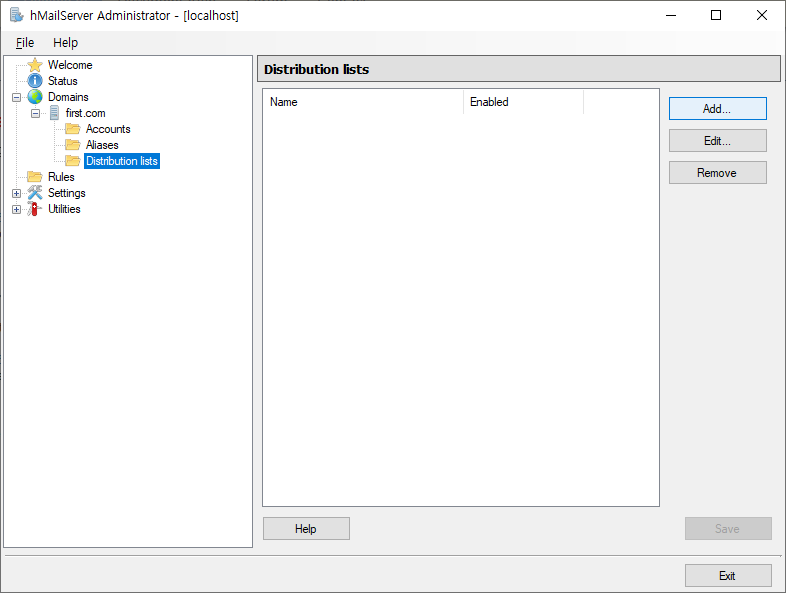  
새로 생성된 도메인의 Accounts 선택 후 우측 `Add` 버튼 클릭

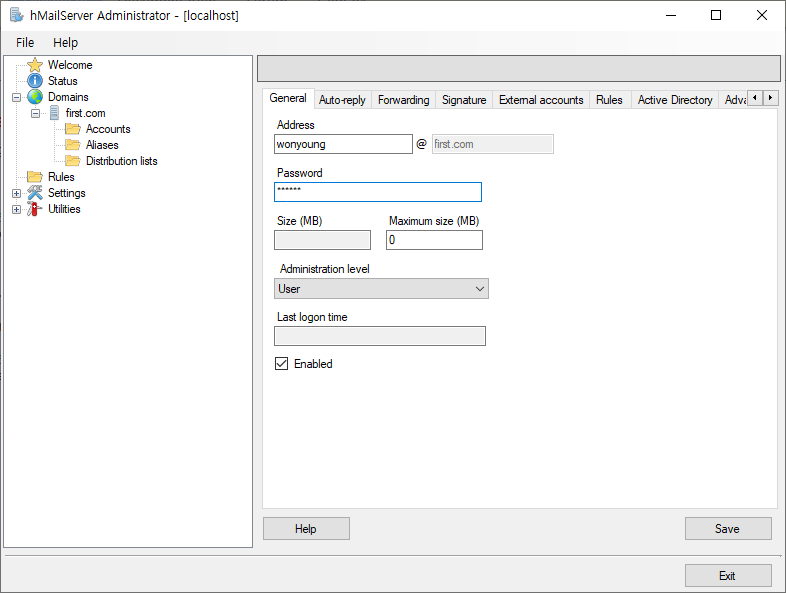  

사용자 이름(여기서는 wonyoung) 입력 후 비밀번호(여기서는 123456)까지 입력 후 `Save` 클릭

암호가 틀릴경우 로그온되지 않는것 방지  
`Settings` -> `Advanced` -> `Auto-ban` 선택후 `Enable` 체크 해제

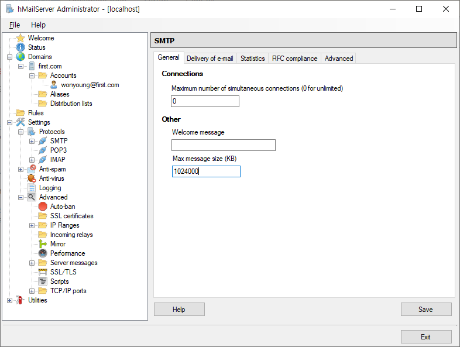
`Settings` -> `Protocols` -> `SMTP` 선택 후 `Max Message size (KB)` 를 1Gb(1024000)로 변경 후 저장

## 이메일 클라이언트 설치

WINCLIENT 가상머신을 부팅

DNS 서버 192.168.110.10 으로 변경  
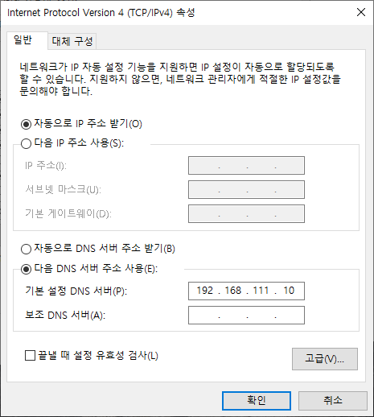

[ThunderBird 다운로드](https://www.thunderbird.net/ko/) 문서 작성일 기준
다운 받고 기본값 설치

설치가 완료 되면 썬더버드가 처음 실행되면서 Account Setup 창이 나온다.
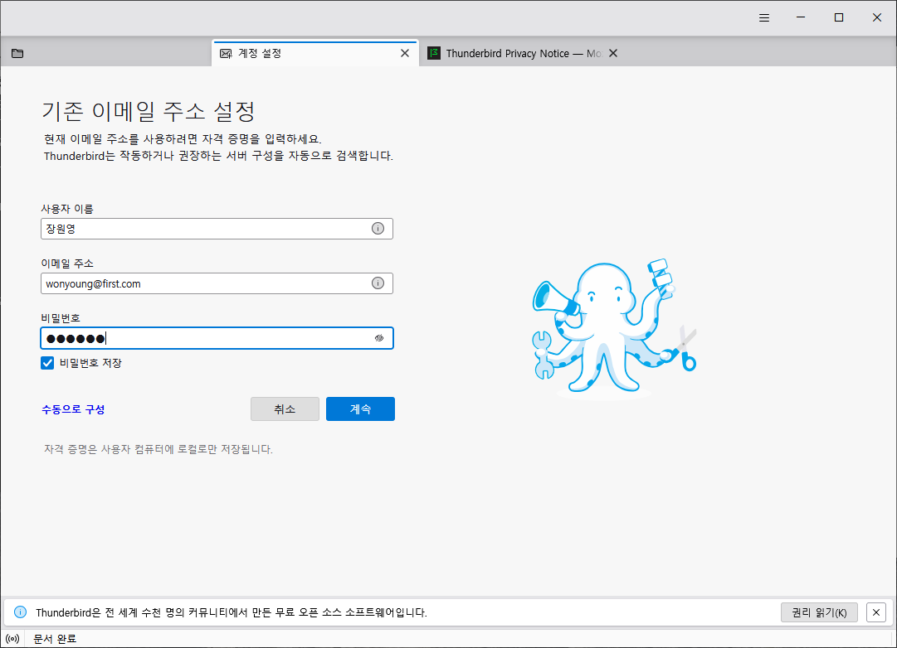  
사용자 이름, 이메일 주소(여기서는 `wonyoung@first.com`), 비밀번호 입력

`계속` 을 눌러도 되지만 어차피 여기선 수동구성해야하므로 그냥 수동으로 구성 해도 된다  
아래 스크린샷 같이 입력

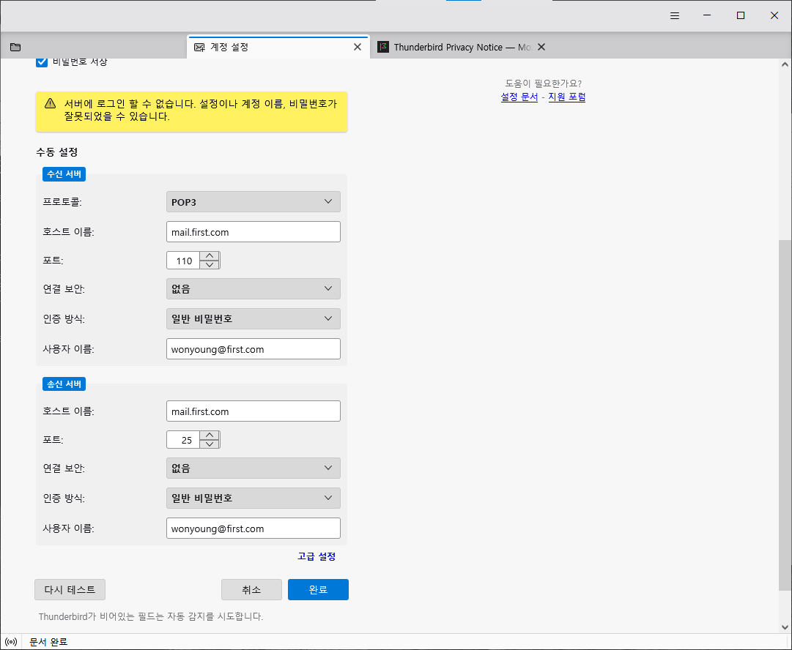

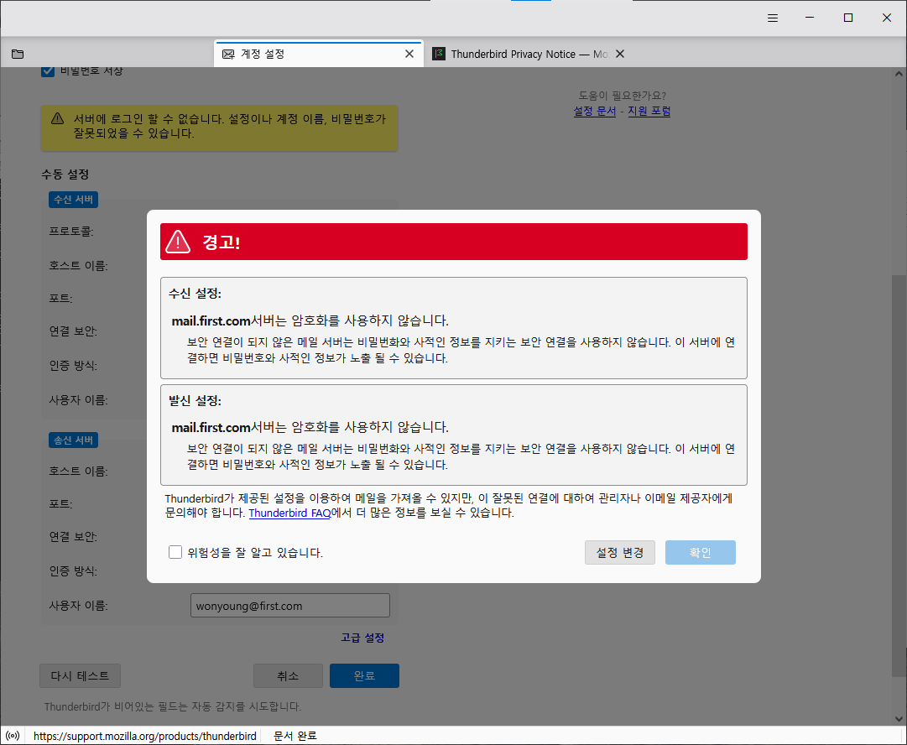  
그럼 경고창이 나오는데 `위험성을 잘 알고 있습니다` 체크하고 `확인` 버튼 클릭

이메일 연결 후

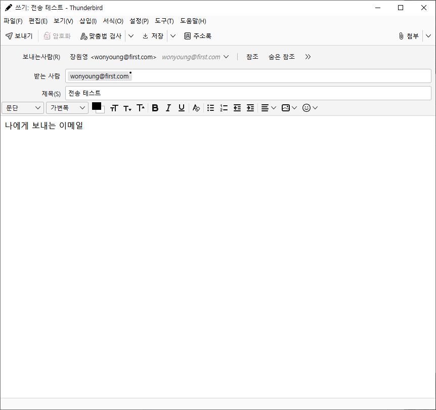
자기에게 전송 테스트

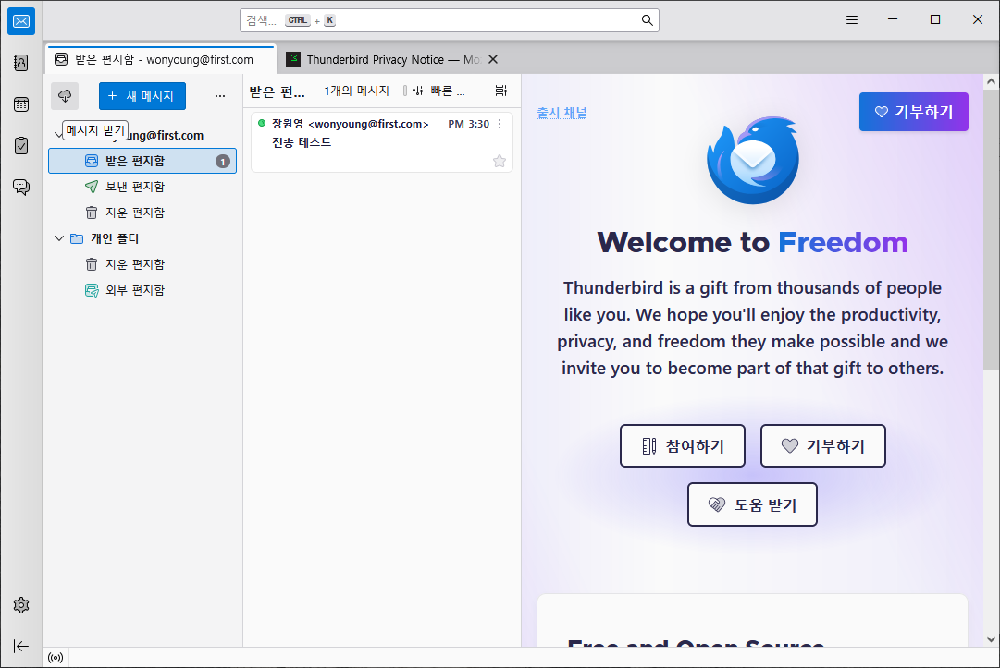
전송 후 우측 상단 구름모양 아이콘을 눌러야 받은 편지함이 최신화 됨

나에게 전송 잘되는것 확인

---

## 위 과정을 SECOND(서버)와 THIRD(클라이언트)에 각각 한번씩 반복

도메인은 second.com 으로 다르게 하면 된다.
