# 2026-03-17-Windows_Server_WDS

<!-- 초안 작성중 -->

## 개념

**WDS(Windows Deployment Services) 란?**

WDS(Windows Deployment Services) 는 네트워크(PXE)로 PC를 부팅시켜 Windows 설치 이미지를 내려보내는 역할.
즉, USB나 DVD를 꽂지 않고도 여러 PC에 Windows를 배포할 수 있게 해주는 Windows 서버 역할(Role)이다.

흐름은 이렇다.

1. 클라이언트 PC가 PXE 부팅
2. WDS 서버가 부팅 이미지(boot.wim) 제공
3. 설치 화면 진입
4. 설치 이미지(install.wim) 선택
5. 네트워크로 Windows 설치 진행

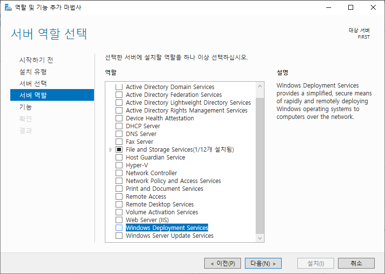

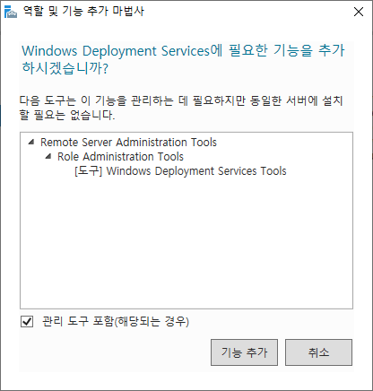

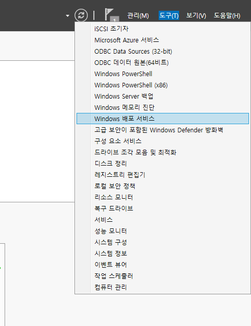

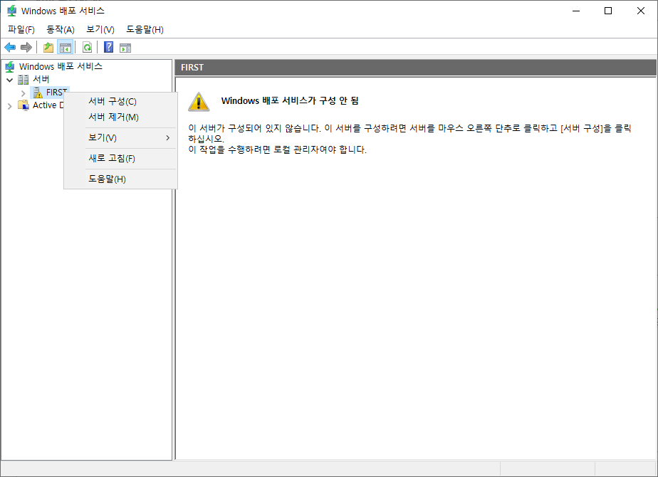

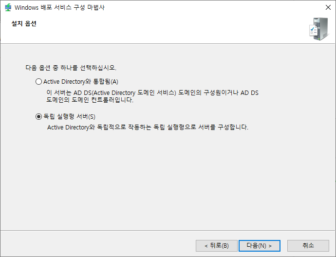

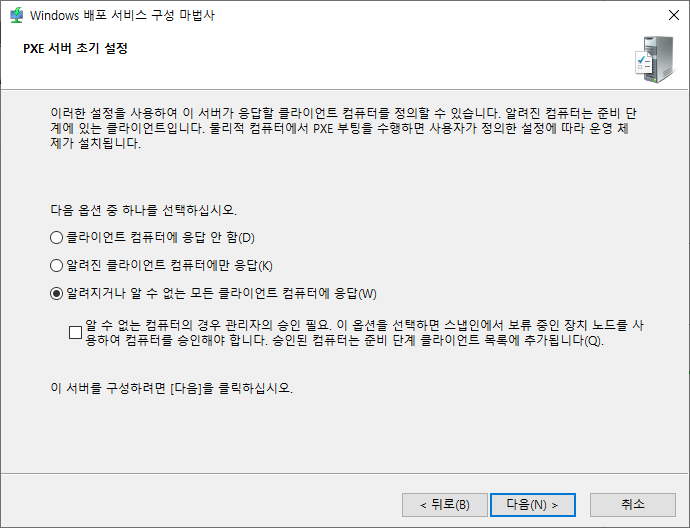

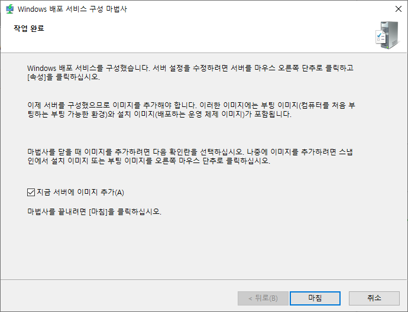

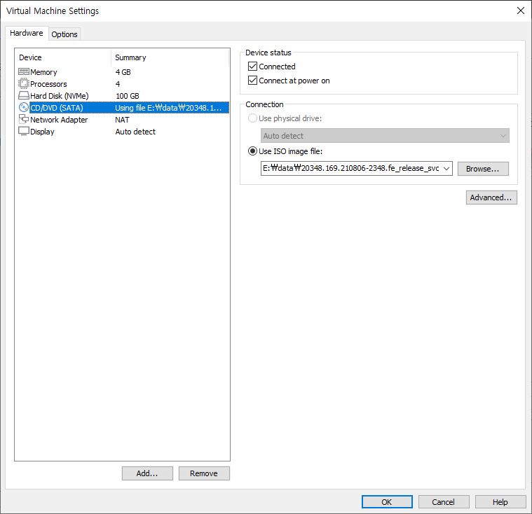

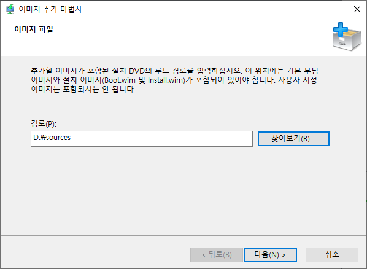

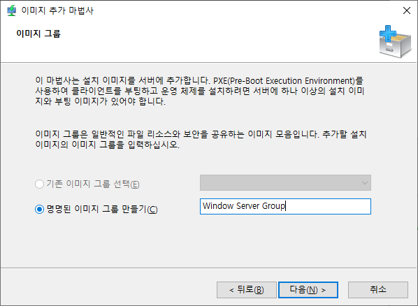

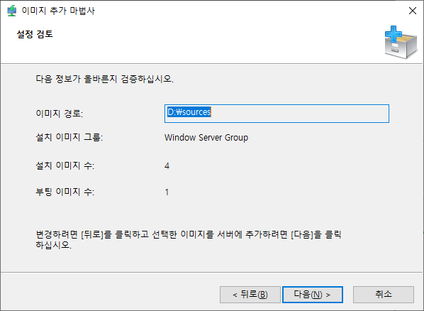

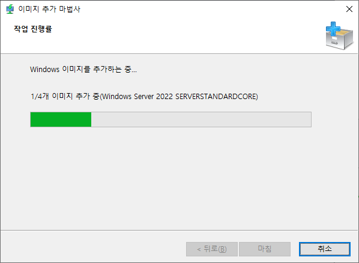

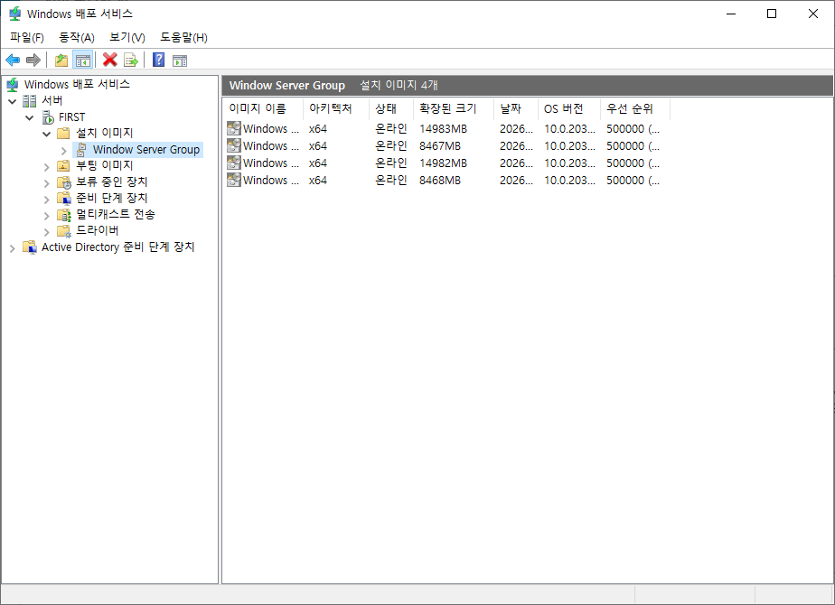

Press Enter for network service 라는 메세지가 나오면 빠르게 엔터
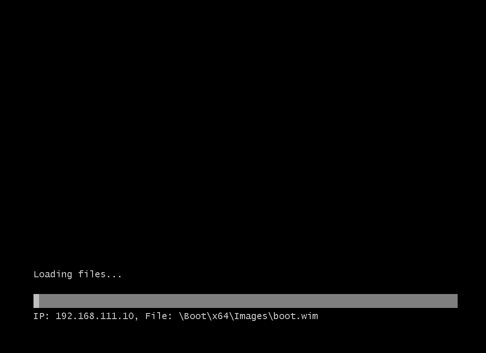

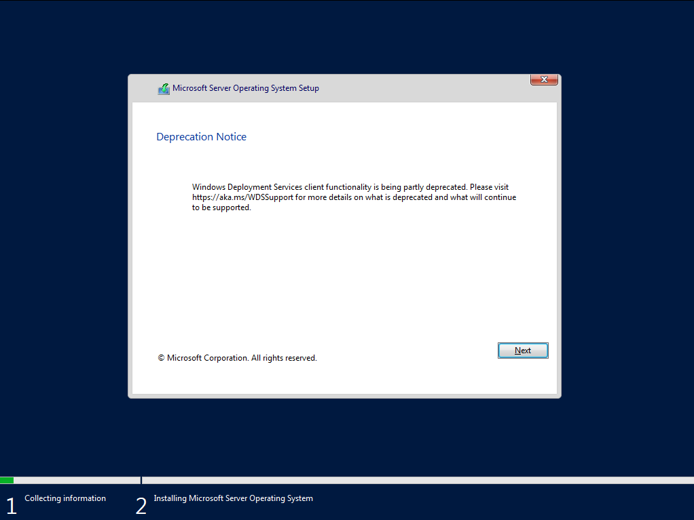

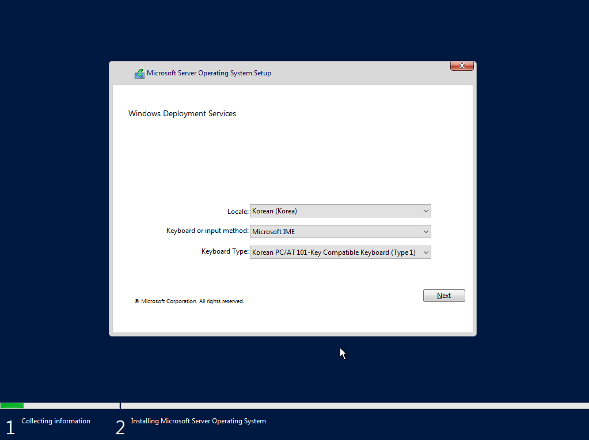

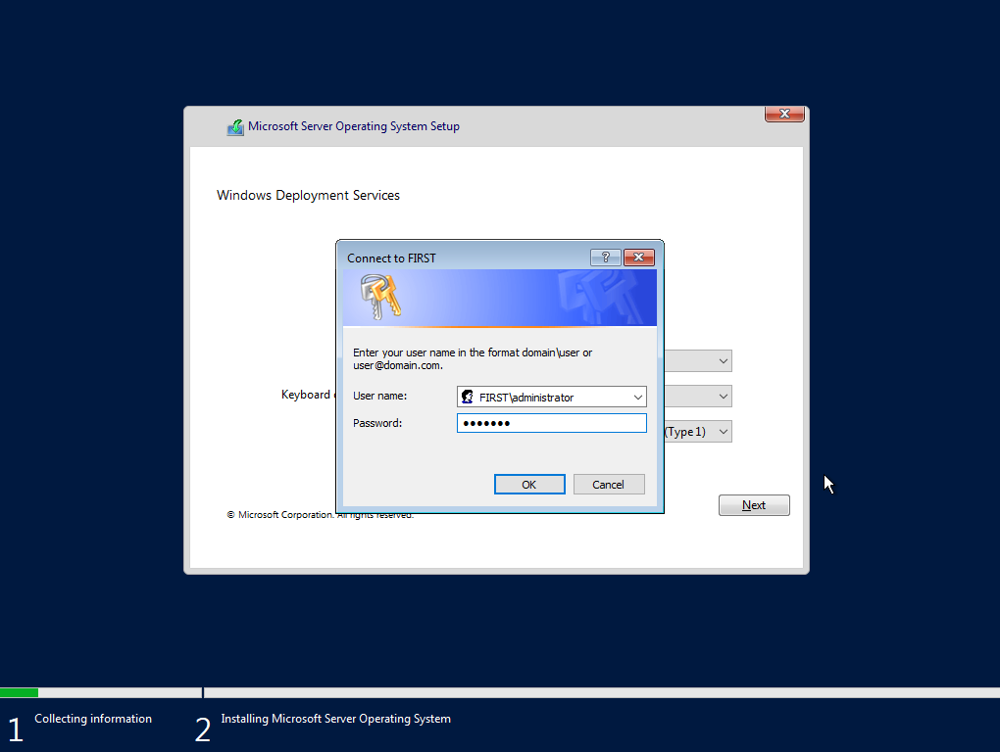

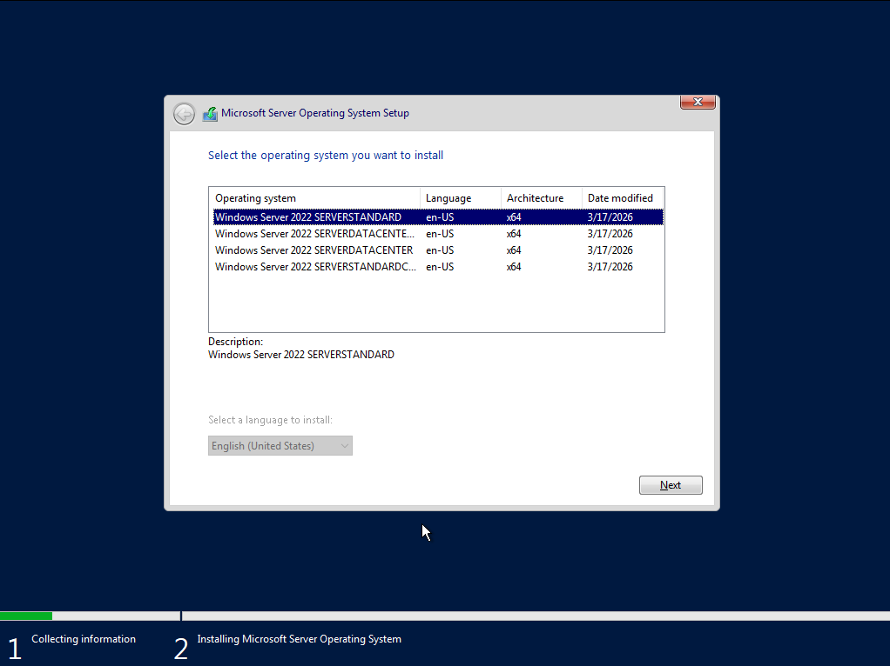
이후로는 기존 Windows Server 2022 설치방법과 동일